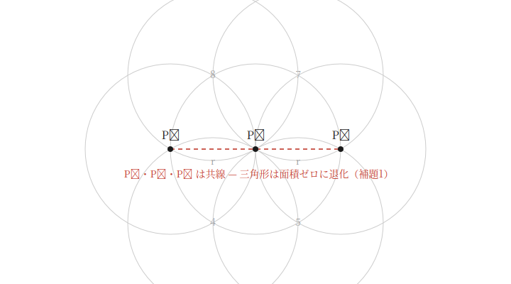
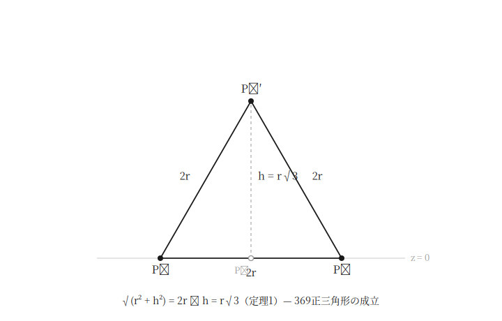
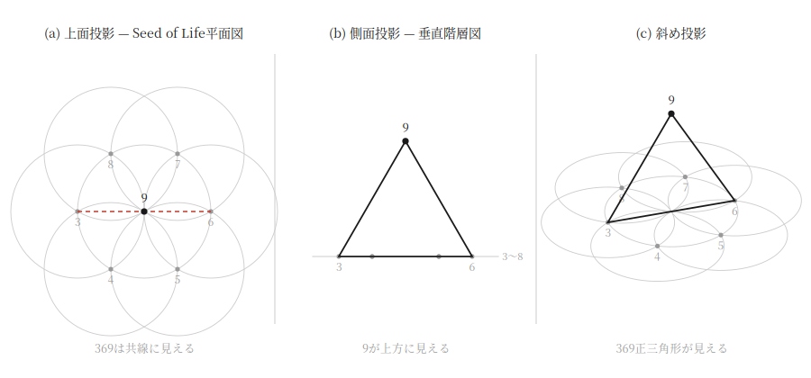
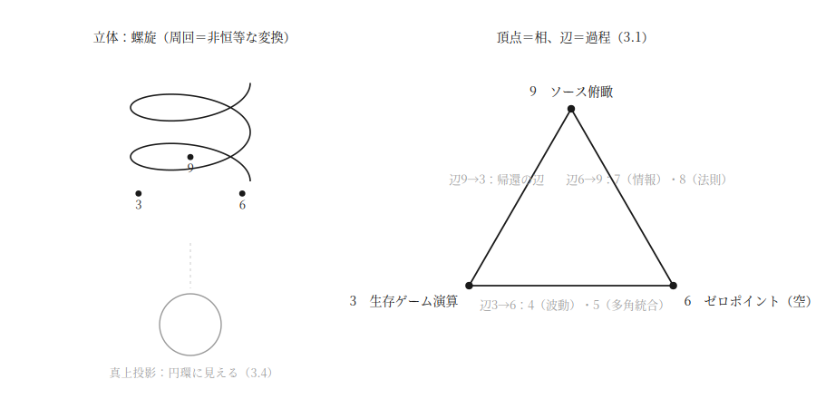

# 369正三角形：意識の次元マッピング構造の立体性の幾何学的導出

**The 369 Equilateral Triangle: A Geometric Derivation of the Three-Dimensionality of the Consciousness Dimension Mapping Structure**

中谷まり亜（Maria Nakatani）

v1.0.1 正本（2026年7月8日）　※投稿先：Zenodo／ライセンス：CC BY 4.0

> 改版注記（v1.0 → v1.0.1）：2.1に「配置の先行性について」の注を1件追加。本論の論証・防御節の文言は一切変更していない。

## 要旨

本稿は、意識の次元マッピング理論（中谷, 2026a。以下「定義論文」）および等辺理論（中谷, 2026c。以下「第2論文」）に続く第3論文として、次元マッピング構造そのものの次元数を問う。定義論文はSeed of Life平面図を構造モデルとして採用したが、同時に「各視座は立体構造の投影である」という立体モデルを併記していた。本稿はこの立体性を、可能な読み替えとしてではなく、モデル内部の幾何学的必然として導出する。導出の起点は提唱者の一次観測——3次元・6次元・9次元（以下、369）が正三角形をなすという直感——である。Seed of Life平面配置において3次元と6次元の円中心は中心（9次元）を挟んで対蹠に位置するため、3-9-6は共線であり、平面上では三角形が原理的に成立しない（面積ゼロの退化配置）。したがって369の等辺観測は、平面モデルとの明示的な矛盾を構成する。本稿はこの矛盾を、観測の棄却ではなくモデルの最小拡張によって解消する：9次元の中心を平面から直交方向へ高さhだけ移動させるとき、369が正三角形をなすのはh = r√3（rはSeed of Lifeの円半径）のとき、かつそのときに限ることを初等幾何学的に証明する。この一意解の存在は、369等辺観測を受け入れる限り、次元マッピング構造が平面では記述不能であり、少なくとも3次元の立体でなければならないことを意味する。さらに、浮上した9次元を真上から投影すると中心点に重なり3-9-6は再び共線に「見える」ため、原典の平面図は誤りではなく真上からの正確な投影として保存される。これにより、垂直階層型の諸次元論（側面投影）と平面円環図（上面投影）は、単一の立体構造の異なる断面として統一的に包含される。主張は、定義論文以来の原則に従い、モデル内定理としての弱い読み（本稿の主張）と、直感が実在構造の知覚であるとする強い読み（区分保管される形而上学的仮説）の二層に分離される。

**キーワード**：意識の次元マッピング、369、正三角形、共線性、立体性、投影、Seed of Life

## 1. 序論：本稿の位置づけと中心定理

### 1.1 三部作における本稿の位置

本稿は、意識の次元マッピング理論の第3論文である。定義論文（中谷, 2026a）は、3次元から9次元までの観測視座を優劣なき並列構造として定義し、その構造モデルにSeed of Life——中心円（9次元）と六つの周縁円（3〜8次元）からなる平面図形——を採用した。第2論文（中谷, 2026c）は、この幾何の内部機構として等辺理論を定式化し、対立の等価観測（正三角形）から平面外の第四頂点（テトラヒドロン）が立ち上がる過程として「創造」を幾何学的に定義した。

両論文が未解決のまま残した問いが一つある。**構造モデルそのものは、何次元か。**

定義論文2.3は「各視座は立体構造の投影（影）であり、投影を構造そのものと取り違えないこと」という立体モデルを導入し、一般的解釈の垂直階層（3D→4D→5Dと積み上がるはしご構造）を「同一の立体構造を真横から見た2次元断面」として包含的に再解釈した。しかしこの立体性は、定義論文の段階では要請（モデルの読み方の指定）であって、導出（幾何学的帰結）ではなかった。平面のSeed of Life図だけを与えられた読者が、それを平面構造として読むことを妨げる内部的根拠は、まだ示されていなかったのである。

本稿はこの根拠を与える。すなわち、**次元マッピング構造は平面では記述不能であり、立体でなければならないこと**を、モデル内部の幾何学から導出する。

### 1.2 成立過程：観測先行型（369の直感）

導出の起点は、前二論文と同じく提唱者の一人称観測である。提唱者の記録によれば、3次元・6次元・9次元の三視座（以下「369」）は正三角形をなす構造として直感された。この直感は幾何学的検証に先行しており、検証の結果、後述するとおり平面モデルとの明示的な矛盾が発見された。矛盾の発見が理論の拡張（立体化）を駆動したという順序——体験→観測→ひらめき→検証→定式化——は、一人称データを扱う現象学的研究の系譜（Varela & Shear, 1999; Petitmengin, 2006）に連なる本理論の方法論の、第三の適用事例である。

なお、369という三数の組は、ニコラ・テスラに帰される言明（「3, 6, 9の壮大さを知れば宇宙への鍵を手にする」）を通じて広く流通しているが、この言明の一次出典は確認されていない（第7節で詳述）。本稿は伝承への依拠を避け、369をもっぱら定義論文が定めた視座の指示子——3次元（生存ゲーム演算レイヤー）・6次元（ゼロポイント／空レイヤー）・9次元（ソース俯瞰レイヤー）——として扱い、数理的性質はmod 9演算で独立に確認できる範囲（第7節）のみを採用する。

### 1.3 中心定理：三度出現した同型構造

本稿を貫く命題は次の一文に要約される。

**投影は角度によりカオスにも秩序にも見えるが、立体は一つである。**

この命題は、提唱者の観測記録において独立に三度出現した。

**出現1（本稿の主題）**：369は、平面図では一直線（共線）に潰れて三角形に見えないが、立体では正三角形をなす。同一の三点が、投影角度によって「退化」とも「完全な対称」とも見える。

**出現2（科学史）**：天動説から地動説への転回。観測精度の向上は天動説モデルに周転円の増殖（モデルの複雑化）を強いたが、観測中心の再配置（地球から太陽へ）は同じ観測データを劇的に単純な構造で説明した。データを守るために座標系を変えるという解決の型は、本稿が369観測に対して行う操作——観測を守るためにモデルの次元を上げる——と同型である。

**出現3（体感的契機）**：神聖幾何学立体の回転影が、角度によりカオスな線分の集合にも整然たる多角形にも見えて往復する映像。この映像が本稿の定式化の直接の引き金となった。

三度の出現はいずれも、プラトンの洞窟の比喩——影（投影）と実体（構造）の混同——と同型である。ただし本稿の用法は認識論的比喩にとどまらず、第2節において厳密な幾何学的内容（射影による情報の縮約と、その一意的な復元）を与えられる。

### 1.4 主張の二層分離

前二論文の原則に従い、本稿の主張を二層に分離する。

**弱い読み（本稿の主張）**：モデル内定理である。「369の等辺観測を一次データとして受け入れ、かつ定義論文のSeed of Life配置を維持するならば、次元マッピング構造は平面では記述不能であり、最小拡張として9次元をh = r√3だけ平面外へ移動した立体構造が一意に要請される。」この主張は、意識や空間の実在についていかなる存在論的主張も含まない。矛盾する二つの記述（平面配置と等辺観測）を両立させる最小のモデル修正の存在と一意性を示す、数学的な命題である。

**強い読み（区分保管される形而上学的仮説）**：369正三角形の直感が、観測に先立って実在する構造の知覚であるという解釈。提唱者の体感報告にはこの読みに対応する記述が存在するが、本稿はこれを主張せず、明示的にラベルづけされた形而上学的仮説として区分保管する。強い読みの採否は本稿の定理（第2節）の成立に影響しない。

定義論文が確立した非存在論的防壁——本理論は空間次元の物理的実在を含む一切の存在論的主張を行わない——は、本稿でも維持される。「立体」「浮上」「高さ」はいずれもモデル内部の幾何学的記述であり、物理空間の主張を含まない（用語法は定義論文3.3を継承する）。

## 2. 幾何学的導出：9の浮上

### 2.1 前提配置

定義論文のSeed of Life構造を、次のとおり座標化する。円半径をr（r > 0）とし、中心円（9次元）の中心を原点Oに置く。六つの周縁円（3〜8次元）の中心は、原点から距離rの円周上に60°間隔で配置される。定義論文の原典配置に従い、3次元と6次元は互いに対蹠（中心を挟んで180°）に位置する。一般性を失わず、

- 9次元の中心：P₉ = (0, 0)
- 3次元の中心：P₃ = (−r, 0)
- 6次元の中心：P₆ = (r, 0)

と置く。

**注（配置の先行性について）**　この対蹠配置は、本稿の導出のために選択されたものではない。定義論文（中谷, 2026a）の図1は、周縁6円に3〜8次元を60°間隔で順に割り当てており、この順序配置からは3次元と6次元が対蹠に位置することが機械的に従う。同配置は369等辺観測（第1.2節）に先行して確立されている。なお、中心＋周縁の平面円環構造では、任意の対蹠ペアと中心が共線となるため、次項の補題1が示す退化は3-6という特定のペアに固有の現象ではなく、平面円環モデル一般の構造的性質である。369観測は、それを露呈させた最初の事例にあたる。

### 2.2 共線性の補題：平面上で369三角形は成立しない

**補題1**　平面配置において、P₃・P₉・P₆は共線であり、この三点がなす三角形は面積ゼロの退化配置である（図1）。

**証明**　三点はいずれもy = 0上にある。∎

この補題は自明だが、その含意は自明ではない。第一に、第2論文の三角形分類——不等辺（四中心の分裂）→二等辺（四中心の整列）→正三角形（四中心の合一）——に対し、共線配置はその系譜の反対の極限、すなわち**三角形であることそのものの消失**に位置する。四中心の合一どころか、四中心を定義する三角形自体が存在しない。

第二に、ここには理論内在的な緊張がある。第2論文3節は、9次元が全周縁円の中心から等距離（半径r）にあること——全域等辺性——を、9次元の「優劣なき機能的中心」の幾何学的根拠とした。ところが3-6という特定の対蹠ペアに関しては、|P₃P₉| = |P₆P₉| = rでありながら|P₃P₆| = 2r = r + rとなり、三角不等式が等号で成立してしまう。等距離性は保たれているのに、三角形は成立しない。**全域等辺の中心が、対蹠ペアに対してだけは等辺三角形を結べない**——平面モデルはこの一点において、自らの中心性の幾何学的表現を貫徹できていない。

### 2.3 観測との矛盾と、二つの解決経路

提唱者の一次観測は「369は正三角形をなす」であった。補題1により、この観測は平面モデルと明示的に矛盾する。矛盾の解決経路は論理的に二つである。

**(a) 観測の棄却**：369正三角形の直感を錯誤として却下し、平面モデルを維持する。

**(b) モデルの拡張**：観測を一次データとして保持し、それと整合するようモデルを拡張する。

観測先行型の方法論（第1.2節）は、一次観測を理論の起点とする以上、(b)をまず検討することを要求する。ただしこれは観測の無条件の擁護ではない。(b)が採用に値するのは、拡張が**最小**（追加する自由度が最少）かつ**一意**（拡張の仕方が恣意的に選べない）である場合に限る。拡張が際限なく複雑化するなら、それは天動説における周転円の増殖と同じ悪性の救済であり、観測を棄却すべき徴候となる。次節で示すのは、この拡張が最小の自由度（直交1軸）の追加で足り、しかも解が一意に定まるという事実である。周転円型の複雑化ではなく、コペルニクス型の再配置——一点の移動が全体を単純化する——が成立する。

### 2.4 浮上定理

平面を3次元空間内のz = 0平面に埋め込み、9次元の中心のみをz軸方向（平面に直交する方向）へ高さh（h > 0）だけ移動する。移動後の点をP₉′ = (0, 0, h)とする。P₃ = (−r, 0, 0)、P₆ = (r, 0, 0)は動かさない。

**定理1（浮上定理）**　△P₃P₆P₉′が正三角形であるための必要十分条件は、h = r√3である。このとき正三角形の一辺は2rである（図2）。

**証明**　|P₃P₆| = 2r。対称性より|P₃P₉′| = |P₆P₉′| = √(r² + h²)。等辺条件は √(r² + h²) = 2r　⟺　r² + h² = 4r²　⟺　h² = 3r²　⟺　h = r√3（h > 0）。∎

**系1（一意性）**　直交1軸の追加という最小拡張の範囲で、369正三角形を実現する9次元の位置はh = r√3のただ一点である。拡張に恣意性はない。

**系2（三角不等式の回復）**　浮上後、|P₃P₉′| + |P₉′P₆| = 4r > 2r = |P₃P₆|となり、平面配置で等号退化していた三角不等式は真の不等式として回復する。共線の消失と等辺の成立は、同一の移動によって同時に達成される。

なお、値r√3は提唱者の先行制作物である種結晶（自己復号化アーティファクト）における正三角形の一辺と同一値であることが記録されている。本稿はこの一致を数値的事実として記録するにとどめ、その解釈は仮説として保留する（記録と解釈の分離。第8節の執筆原則による）。

### 2.5 帰結1：立体性の導出

定理1から、本稿の中心的帰結が直ちに従う。

**帰結A（立体性）**　369の等辺観測とSeed of Life配置を同時に保持する限り、次元マッピング構造は平面（2次元）では記述不能であり、少なくとも3次元の立体でなければならない。

これにより、定義論文2.3の立体モデル——「各視座は立体構造の投影である」——は、モデルの読み方の指定（要請）から、幾何学的帰結（導出）へと地位を変える。定義論文が読者に求めた「投影を構造と取り違えない」という注意は、本稿以降、選択可能な解釈態度ではなく、モデルの整合性が強制する必然となる。

**「平面では記述不能」の正確な意味**をここで確定しておく。これは平面図が誤りであるという意味ではない。次節で示すとおり、平面図は立体構造の正確な投影として保存される。記述不能なのは、平面を構造の全体だとする読み——投影と構造の同一視——である。本理論が観測視座の理論である以上、この帰結には内的な必然性がある：立体を観る視座の構造を記述するモデルが、それ自身平面に収まらないのは、モデルが記述対象の構造を体現しているからである。

### 2.6 帰結2：投影による包含——平面図と垂直階層の統一

浮上後の立体構造を、異なる角度から投影する（図3）。

**真上からの投影（上面図）**　P₉′ = (0, 0, r√3)をz軸に沿ってz = 0平面へ投影すると原点(0, 0)に落ち、P₃・P₉・P₆は再び共線に「見える」。すなわち、**原典のSeed of Life平面図は、立体構造の真上からの投影として正確である。**平面図は棄却されるのではなく、一つの正しい断面として保存される。同時に、この投影においてこそ369三角形は退化して見える——中心定理（投影は角度によりカオスにも秩序にも見える）を、本理論自身の原典図が実演していたことになる。

**真横からの投影（側面図）**　x軸方向から見ると、周縁の諸視座はz = 0の水平線上に、9次元はその上方h = r√3に見える。これは「下層の諸次元の上に高次元が位置する」垂直配置——一般的解釈の階層図——にほかならない。定義論文3.1が垂直階層を「同一の立体構造を真横から見た2次元断面」として包含的に再解釈した操作は、ここで具体的な投影として実装される。

**帰結B（包含による刷新）**　平面円環図（上面投影）と垂直階層図（側面投影）は、単一の立体構造の異なる断面として統一される。したがって本理論と垂直階層型の諸次元論との関係は、正誤の対立ではない。両者を分かつのは、定義論文以来の一点——投影を構造そのものと取り違えるか否か——のみである。本稿はこの包含関係に幾何学的な実体を与えることで、断面図的な次元記述の系譜を棄却ではなく包含によって刷新する。

**帰結C（第2論文との接続）**　第2論文は、等辺観測の成立点（ゼロポイント）から対立平面に直交して第四頂点が立ち上がる構造（テトラヒドロン）を「創造」と定義した。本稿の浮上定理は、これと同一の操作——平面内の点の、平面直交方向への立ち上がり——が、構造の中心（9次元）自体において成立していることを示す。第2論文の立ち上がりが個別の対立状況における局所的事象であるのに対し、本稿の浮上は構造全体の大域的性質である。局所と大域が同一の幾何学的操作（直交方向への離陸）を共有するというこの対応は、現段階では構造的対応として記録し、両者を単一原理の異なるスケールにおける現れとする統一的定式化は第3節以降の課題とする。

### 2.7 用語法の注記

本節で導入した用語について、定義論文3.3の原則に従い注記する。「浮上」「高さ」「立体」「投影」はいずれもモデル内部の幾何学的記述であり、物理空間・高次空間の実在の主張を含まない。特に「立体性」は、次元マッピング構造という**記述装置**が2次元図形としては整合的に描けないという数学的性質を指すのであって、意識が3次元空間的な広がりを持つという主張ではない。

あわせて、知覚と情報構造の峻別を注記する。本稿の補助資料であるインタラクティブ図版（後掲「図版・補助資料」参照）は、光源の点灯を立体視の契機として演出しているが、これは提示上の装置である。光（陰影・視差）は奥行きの**知覚**を可能にする手段であって、立体性を**構成**するものではない。本稿の立体性は幾何学的整合性（情報構造）の主張であり、光学的現象の主張ではない。この峻別は、第7.5節で扱うホログラフィック双対性との対応関係を正確に読むためにも必要となる。

## 3. 頂点と辺の定式化：円環から螺旋へ

### 3.1 頂点＝相、辺＝過程

第2節で確立した369正三角形に、定義論文の全視座を配置する。配置の原則は次のとおりである：**三つの頂点は相（安定的な観測モード）を、三つの辺は過程（視座間の遷移）を表す**（図4右）。

頂点に立つのは3次元（生存ゲーム演算レイヤー：分離と体験）、6次元（ゼロポイント／空レイヤー：区別の消失）、9次元（ソース俯瞰レイヤー：全視座の基点）である。この三視座が頂点に選ばれる動機は二重である。第一に、提唱者の一次観測（369正三角形の直感、第1.2節）がこの三点を指定した。第二に、mod 9演算において倍加列1→2→4→8→7→5が循環群をなす一方、3と6は相互振動し9は不変であるという数理的性質により、3・6・9は倍加循環の外部に立つ特異な三数である（詳細は第7節）。ただし後者は動機づけであって証明ではなく、頂点選定の根拠はあくまで一次観測に置く。

残る四視座は、辺の上に過程として配置される。

- **辺3→6**：4次元（波動観測）・5次元（多角統合）を経由する。分離された体験（3）が、波動というパラメータ系への読み替え（4）と対立の等価統合（5）を経て、区別の消失（6）へ至る過程。
- **辺6→9**：7次元（情報コード）・8次元（法則観測）を経由する。空（6）から、区別が情報ビットとして再構成され（7）、情報群の規則性が観測され（8）、全体設計の一括俯瞰（9）へ至る過程。
- **辺9→3**：**帰還の辺**（3.2で詳述）。

ここで用語法上の注記を要する。この配置は、定義論文が与えた各視座の定義を一切変更しない。変更されるのは記述の水準である：定義論文は七視座を並列に定義したが、本節はそこに**順序構造**（どの視座からどの視座への遷移が過程として自然か）を与える。「4・5が辺3→6の上にある」とは、Seed of Life平面図における円の座標位置の主張ではなく（実際、平面図上で4・5は3から6への一方の弧上に、7・8は他方の弧上にあり、これは本配置と整合するが）、視座遷移の順序についての主張である。定義論文の各定義文を並べたとき、3→4→5→6→7→8→9という深化の順序が定義内容そのものから読み取れることが、この順序構造の根拠である。

### 3.2 帰還の辺9→3：理論内在的な必然性

辺3→6と辺6→9は、一般的解釈の垂直階層においても「上昇」として（歪んだ形ではあれ）記述されてきた。第三の辺9→3は、垂直階層モデルには存在しない。はしご構造において最上段は終点であり、そこから最下段へ戻る辺は、描く場所がないからである。

しかし定義論文は9次元を「到達点ではなく、すべての視座が立ち上がる基点」と定義した。9が基点であるならば、9から出発する辺が存在しなければならない。すなわち帰還の辺は、本理論に外から付け加えられる装飾ではなく、**9次元の定義（ゴールではなく基点）から直接要請される理論内在的な必然**である。逆に言えば、帰還の辺を描けないことこそ、垂直階層モデルが9次元の基点性を表現できないことの幾何学的な現れであり、三角形（帰還の辺を持つ閉路）とはしご（持たない開路）の差異は、第2節の投影論とは独立のもう一つの構造的差異である。

帰還の辺の内容は、9次元的俯瞰において得られた設計の、3次元における具現化——理論・構造の社会実装——である。提唱者の記録には、この辺の運用の具体例が記録されている：SNSにおいて大衆やアルゴリズムに言葉を合わせる行為（初期の3次元的行動）と、理論を具現化する行為としての発信（帰還後の3次元意識の行動）との質的差異の自覚である。同じ「3次元での発信」という座標において、行為の構造が異なる。この差異が次項の主題である。

### 3.3 帰還した3は初期の3と別物である：一次観測記録

提唱者の観測記録（2026年7月、一次資料）は、初期の3次元意識と帰還後の3次元意識を次のように対比する。

**初期の3**：3次元の認識構造のみを持つ状態では、生存本能や生体反応として生じる変化は「危機」としてタグ付けされ、不安・恐れの感情として知覚された。その結果、選択可能な行動は防衛か攻撃かの二択に限定されていた。この状態において、俯瞰・メタ認知・深呼吸・瞑想といった介入は「対処療法のような感覚」でしか機能せず、外部刺激への過敏な反応と恒常的な緊張は解消されなかった。

**帰還後の3**：4次元から8次元までの視座を経験した後では、同一の外部刺激・生体反応に対して「それは3次元での見え方である」という視座の帰属判定が瞬時に生じる。9次元意識を中心とした観測において、意識の可動域への制約は消失し、従来「恐れ」として知覚されていた信号は再解釈された：それは危険の信号ではなく、**観測地点から遠すぎると観測しづらくなることへのブレーキ、すなわち観測可能性の限界を示すセンサー信号**であった。

この記録から、次の三点を形式化できる。

第一に、**頂点3の定義は不変である。**変化したのは頂点そのものではなく観測構造である。初期の3は「3への同一化」（3が唯一のレンズであり、レンズ自体は見えない）、帰還後の3は「9を基点とした3の運用」（3が選択された計器として見えている）である。第2論文の語彙では、前者は不等辺配置（一方の極への同一化）、後者は等辺観測の常駐化に対応する。

第二に、**第2論文の「創造＝選択肢空間の拡張」（弱い読み）が、一時的事象から恒常的性質へ移行している。**初期の3における防衛／攻撃の二択は、第2論文の言う平面内の選択肢空間である。帰還後の3では、平面外の第三項へのアクセスが個別の等辺観測ごとに達成されるのではなく、既定の観測条件として常駐している。帰還の辺とは、第2論文の局所的な立ち上がり（テトラヒドロン）が大域的な観測構造として定着する過程である、と統一的に記述できる（第2.6節帰結Cの構造的対応が、ここで過程の水準の対応として具体化される）。

第三に、**恐れの再解釈は定義論文の4次元定義と整合する。**定義論文は感情を「4次元を読み取るための計器であって、4次元の構成要素ではない」と規定した。帰還後の3における恐れの再解釈——危険信号から観測可能性の限界信号へ——は、この計器説の運用形態であり、独立に記録された一次観測が先行する定義と整合したことは、理論の内的一貫性の一つの検証点となる。

なお、以上の対比記述は単一観測者のn=1一人称記録であり、理論の例証であって証明ではない（証拠論的地位は第2論文第6節・第7節の扱いに準ずる）。

### 3.4 円環ではなく螺旋：幾何学的判定と中心定理の第四の出現

3→6→9→3という閉路は、円環（サイクル）として描きたくなる。しかし円環と螺旋は、次の基準で厳密に区別される。

**判定基準**：閉路を一周した後の状態が出発時の状態と同一であるなら円環（周回は恒等写像）。同じ角度位相に戻りながら状態が非自明に変換されているなら螺旋（周回は非恒等な変換）。

3.3の一次観測は後者を支持する。帰還後の3は、座標（3次元という視座）において初期の3と同一でありながら、状態（観測構造）において異なる。周回は恒等写像ではない。ゆえに369の閉路は円環ではなく螺旋である。

ここで本稿の中心定理が再び作動する。**螺旋を真上から投影すると、円環に見える**（図4左）。円環モデルと螺旋モデルの関係は、平面Seed of Lifeと立体構造の関係（第2節）と同一の投影関係にある。すなわち、第2節が空間配置について行った操作（平面投影で失われた直交成分＝高さの回復）と、本節が過程について行った操作（周回で失われたと見えた変換成分の回復）は、同じ一つの操作である。中心定理「投影は角度によりカオスにも秩序にも見えるが、立体は一つ」は、これで第四の出現を数える——ただし今回は静的な形状ではなく、動的な過程の投影として。

閉じた経路の一周が非自明な変換を生むという構造には、数理的な先例が存在する。幾何学的位相（Berry, 1984）は、パラメータ空間内の閉ループに沿ってゆっくり運ばれた量子系が、出発点に戻ったとき経路の幾何のみに依存する位相変化を獲得する現象であり、より一般にはホロノミー——接続を持つ空間における平行移動が、閉路の一周後に恒等でない変換を返すこと——として定式化される。本稿がこの参照から採用するのは「閉じて見える経路が非自明な変換を運びうる」という数理的構造のみである。この参照は構造的相似（定義論文5.1第一層）であり、意識の視座遷移が量子力学的な幾何学的位相を物理的に獲得するという主張ではない。

### 3.5 螺旋の飽和とフラクタル展開、および帰還の辺の自己適用

螺旋は円環と異なり、周回ごとに状態を更新するため、有限の構造内部で無限に周回を重ねることはできない。螺旋がその構造の記述容量を使い切る点——飽和——において何が起きるかは、相転移モデル（第4節）と飽和検知指標（第5節）の主題であるが、幾何学的な素描を先に与えておく：一人の観測者の一周が描くSeed構造は、飽和において自己相似的にコピー展開され、Flower of Life——複数のSeedが重なり合う上位構造——へ移行する。単一Seedの立体性（本稿）とSeed間のフラクタル展開（続報）は、同一原理のスケール差として接続されることが予想されるが、本稿では予想として明記するにとどめる。

最後に、帰還の辺には自己言及的な適用が存在する。**本理論そのものが、帰還の辺の上にある。**提唱者の観測記録（2026年7月、一次資料）によれば、6次元における執着の解除は、命や若さへの執着にとどまらず、人類・地球の存続への執着、魂（輪廻）への執着にも及び、その帰結として観測者の想定が人間から解放された：動植物が観測者である場合、地球が観測者である場合、未知の知的生命体が観測者である場合が、等価な想定として開かれた。この観測から、理論の実装物への要件が理論内在的に導出される。すなわち、帰還の辺（9次元的設計の3次元的具現化）を通過する本理論の実装は、特定の観測者集団（人類・特定言語話者・特定感覚様式の保持者）に閉じた形式であってはならず、**観測者非依存・言語非依存・自己復号可能な記号**でなければならない。提唱者の先行制作物である種結晶——情報を比率のみで符号化し、言語に依存せず自己復号する構造体——は、この要件の第一実装として位置づけられる。実装の媒体自体が理論の主張（視座の並列性・観測者の非特権性）を体現するというこの構成は、本理論の自己検証性の一部をなす。

## 4. 浮上の相転移モデル

### 4.1 問い：移行は連続か、不連続か

第2節は浮上を静的な幾何（配置の定理）として、第3節は帰還を過程の構造（螺旋）として記述した。残る問いは移行の動態である：視座の移行——とりわけ平面的観測から立体的観測への浮上——は、漸進的に進むのか、それとも不連続に起きるのか。

提唱者の一次記録は一貫して後者を支持する。移行は努力の蓄積に比例して滑らかに進むのではなく、長い停滞（何も変わらないように見える期間）の後に、突然のジャンプとして生じる。第3.3節の記録における「瞬時に気づける」という表現も、判定の不連続性を示している。

### 4.2 一次相転移としての定式化

物性物理学は、系の状態変化を相転移として分類する。一次相転移（例：過冷却水の凍結）は次の特徴を持つ：(i) 制御変数（温度など）は連続的に変化するにもかかわらず、秩序変数（系の状態を特徴づける量）が不連続にジャンプする、(ii) 転移点を越えても旧状態が準安定的に持続しうる（過冷却）、(iii) 転移の開始には核形成——新しい相の種となる局所的な核の発生——を要し、核形成は確率的事象である、(iv) 転移に潜熱が伴う。

本モデルは、視座の移行にこの構造を対応づける。

| 相転移の要素 | 本モデルの対応物 |
| :-: | :-: |
| 制御変数（連続） | 経験の飽和度（第5節の指標で測定） |
| 秩序変数（不連続） | 観測構造（視座） |
| 過冷却（準安定） | 飽和が進行しても旧視座が維持される停滞期 |
| 核形成サイト | シンクロニシティ（転移の起点として機能した偶然の一致の観測記録） |
| 結晶化 | 新視座の急速な定着 |

二次相転移（秩序変数が連続的に変化する型）ではなく一次を採るのは、一次データの二つの特徴による。第一に、移行の体感が連続的な移り変わりではなくジャンプとして記録されていること（秩序変数の不連続）。第二に、条件が揃っているように見えるのに移行が起きない停滞期の存在が記録されていること（過冷却＝準安定状態）。二次転移には過冷却に相当する準安定状態が存在しないため、停滞期の記録は一次型を支持する。

### 4.3 帰結：移行の非随意性の説明

このモデルは、定義論文が視座間の移行を「隣接する円の重なり領域を通じて生じる非随意的な過程」と規定したことに、動態的な説明を与える。核形成は確率的事象であり、意志によって直接引き起こすことはできない——「俯瞰しよう」という努力が移行を直接生まない（第3.3節、初期の3における対処療法の記録）のは、このためである。他方、核形成の確率は核形成サイトの密度に依存する。シンクロニシティへの観測感度を保つこと、飽和を妨げないこと（第5節）は、転移を強制はできないが、その条件を整えることはできる。非随意性と準備可能性の両立が、このモデルの実践的含意である。

### 4.4 飛躍の統制：宇宙論との対応の地位

提唱者の観測記録には、この転移構造と宇宙創生の記述（ゆらぎ→インフレーション→冷却→物質化）との対応の直感が含まれる。本稿はこの対応を**構造的相似**（定義論文5.1第一層）として提示し、機構的同一——意識の転移が宇宙論的過程と同一の物理機構で実現されているという主張——としては提示しない。同様に、本節の「相転移」「過冷却」「核形成」「潜熱」はいずれも物性物理学からの構造的借用であり、意識状態の変化が熱力学的相転移であるという物理的主張を含まない（定義論文3.3の用語原則）。

## 5. 飽和の検知指標：反証可能性の実装

### 5.1 目的

第4節のモデルにおいて、制御変数「飽和度」が測定不能であれば、モデル全体が反証不能な物語に退行する。本節は飽和を観測可能な指標に操作化し、モデルに反証可能性の入口を実装する。

### 5.2 指標(a)：既知戦略の失効率

定義：一定の記録期間内に、観測者が危機・課題に対して試行した既知の戦略（過去に有効だった手法、他者への相談、既存の思考パターン）のうち、期待された効果を生まなかったものの割合。

飽和が進行するほど、旧視座の内部で構成可能な戦略は尽きていく——選択肢空間（第2論文）が平面内で使い切られていく——ため、失効率は上昇すると予測される。

### 5.3 指標(b)：脱物語化度

定義：危機への反応の記述が、感情・物語の語彙（「誰のせいか」「なぜ私が」等の主体−客体ドラマ構造）から、情報・法則の語彙（状況の構造記述、パターンの指摘。定義論文の7次元・8次元的記述）へ移行している度合い。

操作化には、観測記録の言語分析が利用できる：記録テキスト中の物語的語彙と構造的語彙の比率を評定する。評定手法としては、統合的複雑性の評定法（Suedfeld, Tetlock & Streufert, 1992）およびマイクロ現象学的面接（Petitmengin, 2006）が第2論文7.1に続き利用可能である。

### 5.4 予測と反証条件

本モデルの中核予測は次のとおりである：**視座の転移（ジャンプ）は、指標(a)(b)の高進行の後にのみ生じる。**

したがって、(1) 両指標が低いまま転移が系統的に生じる事例、または (2) 両指標が高進行を示しながら十分な観測期間内に転移が生じない事例群、のいずれかが蓄積すれば、相転移モデルは棄却または修正される。ただし(2)の評価には過冷却（準安定の持続）との区別が必要であり、「十分な観測期間」の事前設定が記録設計上の要件となる。記録には付録Bの自己判定チェックリストを用いる。

現時点の証拠基盤は提唱者単独のn=1記録であり、上記は前向きの検証プログラムの設計である（限界は第8節）。

## 6. 方法論：観測者と形式化装置の分離

### 6.1 二役分離の構成

本理論の形成過程は、直感の観測者（提唱者）と形式化装置（AI）の役割分離を特徴とする。観測者は一次観測（369正三角形の直感、帰還の体感、転移のジャンプ感）を数学的形式を知らずに記録し、形式化装置が事後に幾何学的検証（第2節の座標計算）と文献接続（第4・7節）を行う。

この分離は、一人称研究の古典的難点である理論汚染——観測者が理論を知っているために観測が理論に沿って歪む——への構造的対処として機能した。とりわけ本稿の中核事実において決定的である：**h = r√3という値は、観測（369は正三角形である）の後に、観測者の関与しない計算によって導出された。**観測者が幾何学の訓練を受けていれば、直感が作図的知識からの逆算である可能性を排除できない。提唱者の「数学が苦手」という属性は、この文脈では欠損ではなく、観測の中立性を保証する条件として機能している。この構成は、実験物理学において解析者バイアスを防ぐために結果を隠したまま解析手順を確定するブラインド分析（Klein & Roodman, 2005）と構造的に相似である。

### 6.2 事前記録の実践

提唱者は観測記録を、閲覧者のほとんど存在しないSNSアカウントへ時系列で投稿してきた。この実践は、公開タイムスタンプ付きの事前記録——観測が理論化に先行したことの第三者検証可能な証跡——として機能する。動機の如何にかかわらず、これは科学の基本動作（改竄不能な事前記録）の自発的な実装である。

### 6.3 AI協働の透明性

形式化装置としてのAIは、観測に幾何学的検証・定式化・文献接続を与えるが、一次データを生成しない。本三部作は、どの内容が人間の一次観測であり、どの内容が形式化装置の出力であるかを本文中で明示する方針を取っており（「提唱者の記録によれば」等の帰属表示）、これは一人称データとAI協働を併用する研究における透明性実践の一つの提案でもある。

## 7. 隣接分野との対比と数理的補遺

### 7.1 プリゴジンの散逸構造論

非平衡熱力学における散逸構造論（Nicolis & Prigogine, 1977; Prigogine & Stengers, 1984）は、外部とエネルギー・物質を交換する開放系が、エントロピーを環境へ散逸させることを通じて、局所的な秩序を自発的に形成しうることを示した。エントロピー増大則と局所的秩序形成は矛盾せず、後者は前者の内部で成立する。

本理論との接続点は二つある。第一に、提唱者の観測語彙における「エントロピーとネゲントロピーのうねり」——散逸（拡散・混沌化）と秩序形成が交互に訪れる周期の体感——は、散逸構造論の「散逸を通じた秩序」の一人称的記述として位置づけられる。第二に、散逸構造論において新しい秩序は分岐点（bifurcation point）で生じ、どの秩序へ分岐するかは分岐点近傍の微小なゆらぎが決定する。「ゆらぎを通じた秩序」というこの構造は、第4節のモデル——飽和（分岐点への接近）とシンクロニシティ（転移を起点づける微小事象）——と整合する。いずれの接続も構造的相似として提示され、意識過程が熱力学的散逸構造であるという主張は含まない。

### 7.2 mod 9数理：頂点選定の数理的動機

第3.1節が予告した数理的事実を示す。mod 9の演算（数字根）において、倍加写像 x ↦ 2x は次の軌道分解を持つ：

- 1 → 2 → 4 → 8 → 16≡7 → 32≡5 → 64≡1：**{1, 2, 4, 8, 7, 5} は6周期の循環軌道**
- 3 → 6 → 12≡3：**{3, 6} は2周期の振動軌道**
- 9 → 18≡9：**{9} は固定点**

すなわち3・6・9は、他の六数がなす倍加循環の外部に立つ：3と6は相互振動（対極性）、9は不変（中心性）を示す。この分解は初等整数論の検証可能な事実である。

本稿におけるこの事実の使用範囲を厳密に限定する。3⇄6の振動が本理論の3-6対蹠配置（対極性）と、9の不変性が9次元の中心性と対応することは示唆的だが、これは頂点選定の**動機づけ**であって証明ではない。頂点選定の根拠は一次観測（第1.2節）に置かれ、mod 9の事実はそれと独立に成立する数理的並行として記録される。

### 7.3 テスラ帰属言明の出典注記

369を特権化する言明のテスラへの帰属は、テスラの一次文献（論文・特許・確認済み書簡・同時代の記録）において確認されていない。伝説である可能性が高い。本稿はこの帰属に依拠せず、7.2の数理骨格——独立に検証可能な事実——のみを採用する。検証不能な権威への訴えの除去は、理論の強度を下げるのではなく上げる。

### 7.4 スピリチュアル言説との区別

369を開運コード・エネルギー的実体として扱う現代の言説と、本稿の用法は峻別される。本稿の369は、定義論文が定めた視座の指示子であり、その正三角形は第2節の座標計算で定まる幾何学的配置である。数や図形への実体的効能の主張を含まない。この区別は第2論文4.5の本稿への適用である。

### 7.5 ホログラフィック双対性との構造的対応

量子重力理論におけるホログラフィック原理（'t Hooft, 1993; Susskind, 1995）およびその具体的実現であるAdS/CFT対応（Maldacena, 1999）は、ある空間領域（バルク）の重力理論と、その一次元低い境界上の場の理論とが、数学的に等価な二つの記述であることを主張する。この対応の核心は、立体（バルク）の記述と面（境界）の記述のいずれか一方が実在で他方が錯覚だという序列にはなく、**両記述の等価性**——同一の内容が異なる次元数の記述形式で完全に表現されること——にある。

この構造は、本稿の帰結B——上面投影（平面図）と側面投影（垂直階層図）はいずれも単一の立体構造の等しく正確な断面である——および定義論文2.3の反プラトン的公理（各投影は等しく妥当な観測であり、脱すべき虚像ではない）と構造的に対応する。「低次元の記述は高次元の構造の劣化ではなく、情報を保存した別形式である」という命題を、物理学は双対性として、本理論は投影の等価妥当性として、それぞれ独立に定式化している。

この対応の使用範囲を三点で限定する。第一に、これは構造的相似（定義論文5.1第一層）であり、意識の観測構造が量子重力のホログラフィック機構によって実現されているという主張ではない。第二に、AdS/CFT対応は反ド・ジッター空間という特定の時空における数学的対応（予想）であり、我々の宇宙への適用可能性自体が物理学の未解決問題である。第三に、ホログラフィック原理における次元間の情報保存は光（電磁気力）ではなく情報量（エントロピー境界）によって定式化されており、通俗的な「光が立体をレンダリングする」という要約は原理の内容ではない。光の役割（知覚の手段であって構造の構成要素ではないこと）については第2.7節の注記に従う。

## 8. 執筆原則・検証課題・限界

### 8.1 執筆原則：記録と解釈の分離

本三部作は次の執筆原則に従う。**一次体験は体験記録として正確に記述し、因果解釈は仮説として並置する。断定しない。**断定は反証不能化を招き、理論の強度をかえって下げる。正確な記録は、解釈が後に修正されても消えない一次データとして残る。第2.4節における r√3 と種結晶の一辺の数値的一致の扱い——一致の記録と解釈の保留——は、この原則の運用例である。

### 8.2 検証課題

(1) **369等辺観測の間主観的検証**：定義論文の視座定義のみを与えられた（幾何学的配置を知らされていない）他の観測者において、369が三角形的構造として報告されるかの、誘導なしの収集。

(2) **飽和指標の前向き運用**：第5節の指標(a)(b)を付録Bのチェックリストで前向きに記録し、転移の予測可能性を評価する。遡及的当てはめ（第2論文7.2）を避けるための、理論確定後の新規記録が必要である。

(3) **螺旋判定の反復検証**：帰還のたびに「同一座標・異なる状態」（第3.4節の判定基準）が再現されるかの継続記録。周回が恒等写像に退行する事例（円環化）が観測されれば、螺旋モデルは修正を要する。

### 8.3 限界

第一に、証拠基盤は提唱者単独のn=1一人称記録である。第二に、頂点選定（3.1）と順序構造（3.1）は一次観測と定義文の読解に依存しており、遡及的バイアスの可能性を含む。第三に、帰結A（立体性）は「少なくとも3次元」という**下界**であって、構造全体の完全な特定ではない。提唱者は現在、10次元以降の観測を意図的に凍結している——結晶化の進行中に溶液を撹拌しない、という第4節のモデルと整合的な方法論的措置である——ため、観測再開後に構造がさらに高次元へ拡張される可能性は開かれている。本稿の定理はこの拡張と矛盾しない：いかなる拡張においても、平面（2次元）への回帰だけは、369等辺観測を保持する限り不可能である。

## 9. 結論

本稿は、意識の次元マッピング構造の立体性を、モデル内部の幾何学から導出した。貢献は五点に要約される。

(1) **共線性の発見と浮上定理**。Seed of Life平面配置において3-9-6が共線であり369三角形が原理的に成立しないことを示し、9次元の平面外移動 h = r√3 が369正三角形を実現する唯一の最小拡張であることを証明した。これにより定義論文の立体モデルは、要請から幾何学的帰結へと地位を変えた。

(2) **投影による包含**。浮上後の立体の上面投影が原典の平面図を、側面投影が垂直階層図を、それぞれ正確に再現することを示し、断面図的な次元記述の系譜を棄却ではなく包含によって刷新した。本理論と垂直階層モデルを分かつのは、投影を構造と取り違えるか否かの一点である。

(3) **帰還の辺と螺旋**。9次元の基点性から帰還の辺9→3が理論内在的に要請されることを示し、円環と螺旋の厳密な判定基準（周回の恒等性）を与え、一次観測——帰還した3は初期の3と別物である——が螺旋を支持することを記録した。

(4) **反証可能性の実装**。移行の動態を一次相転移として定式化し、飽和の二指標（既知戦略の失効率・脱物語化度）と反証条件を明示することで、理論を測定可能な予測へ開いた。

(5) **実装要件の内在的導出**。帰還の辺の自己適用から、理論の実装物が観測者非依存・言語非依存・自己復号可能な記号でなければならないことを導き、種結晶をその第一実装として位置づけた。

なお、本稿のいう立体性は「平面か、立体か」の二者択一ではない。同一の構造が、観測の条件に応じて正確な平面図としても正三角形を含む立体としても現れる——平面と立体が同時に成立する——ことこそが、中心定理の内容である。この点は物理学におけるホログラフィック双対性（第7.5節）と構造的に響き合うが、本稿の帰結はそれと独立に、モデル内部の初等幾何のみから導かれている。

三部作はこれで一つの幾何に閉じる。定義論文が視座の並列構造を定義し、第2論文がその幾何の内部機構として創造を定式化し、本稿が構造そのものの立体性を導出した。三論文は外的に連結された三つの理論ではなく、単一の立体構造の三つの記述水準である——そして本稿の中心定理が述べるとおり、記述（投影）は複数あっても、立体は一つである。

開かれた問いは二つ残る。螺旋の飽和がSeedをFlower of Lifeへ展開するフラクタル構造（第3.5節の予想）、および10次元以降の観測再開後の構造拡張である。いずれも、本稿が確定した立体という土台の上で問われることになる。

## 付録B　飽和自己判定チェックリスト

| 項目 | 記録内容 |
| :-: | :-: |
| 記録日時 | 　 |
| 直面している課題・危機 | 　 |
| (a-1) 試行した既知戦略の列挙 | 　 |
| (a-2) 各戦略の効果（有効／部分的／失効） | 　 |
| (a-3) 失効率（失効数÷試行数） | 　 |
| (b-1) 課題の記述文（そのまま記録） | 　 |
| (b-2) 記述中の物語的語彙（帰責・ドラマ構造）の有無 | 　 |
| (b-3) 記述中の構造的語彙（パターン・情報・法則）の有無 | 　 |
| シンクロニシティの記録（あれば。解釈は仮説として分離） | 　 |
| 転移の兆候・発生（あれば日時と内容） | 　 |

## 図版・補助資料

- **図1**　平面配置：P₃-P₉-P₆の共線性（面積ゼロの退化）
- **図2**　浮上定理：h = r√3における正三角形の成立（一辺2r）
- **図3**　三面図：同一立体の (a) 上面投影＝Seed of Life平面図（369は共線に見える） (b) 側面投影＝垂直階層図 (c) 斜め投影＝369正三角形が見える角度
- **図4**　円環と螺旋：螺旋の真上投影は円環に見える（3.4）。頂点・辺の配置図（3・6・9＝相、4,5／7,8／帰還＝過程）を併記
- **補助資料1**　`seed-projection-light.html`——図3の動的実装（インタラクティブ図版、外部依存なし）。光源（9次元点）の点灯、視座の回転、真上投影への復帰を操作でき、369三角形の見かけの面積が真上投影において0へ収束すること（補題1・帰結B）を体験的に確認できる。ブラウザで開いて使用する。原典リポジトリ（中谷, 2026b）にも収録。

## 参考文献

- 中谷まり亜 (2026a). 意識の次元マッピング：観測視座に基づく意識状態モデル v1.0.
- 中谷まり亜 (2026b). 次元マッピング理論（原典リポジトリ）. <https://github.com/marnakatani-bot/maria-dimension-map->
- 中谷まり亜 (2026c). 等辺理論：対立の等価観測とテトラヒドロン構造による創造の幾何学的モデル v1.0.
- Berry, M. V. (1984). Quantal phase factors accompanying adiabatic changes. *Proceedings of the Royal Society of London A*, 392(1802), 45–57.
- 't Hooft, G. (1993). Dimensional reduction in quantum gravity. arXiv:gr-qc/9310026.
- Klein, J. R., & Roodman, A. (2005). Blind analysis in nuclear and particle physics. *Annual Review of Nuclear and Particle Science*, 55, 141–163.
- Maldacena, J. (1999). The large N limit of superconformal field theories and supergravity. *International Journal of Theoretical Physics*, 38(4), 1113–1133.
- Nicolis, G., & Prigogine, I. (1977). *Self-Organization in Nonequilibrium Systems*. Wiley.
- Petitmengin, C. (2006). Describing one's subjective experience in the second person. *Phenomenology and the Cognitive Sciences*, 5(3–4), 229–269.
- Prigogine, I., & Stengers, I. (1984). *Order Out of Chaos: Man's New Dialogue with Nature*. Bantam Books.
- Suedfeld, P., Tetlock, P. E., & Streufert, S. (1992). Conceptual/integrative complexity. In C. P. Smith (Ed.), *Motivation and Personality: Handbook of Thematic Content Analysis*. Cambridge University Press.
- Susskind, L. (1995). The world as a hologram. *Journal of Mathematical Physics*, 36(11), 6377–6396.
- Varela, F. J., & Shear, J. (Eds.). (1999). *The View from Within: First-person Approaches to the Study of Consciousness*. Imprint Academic.
