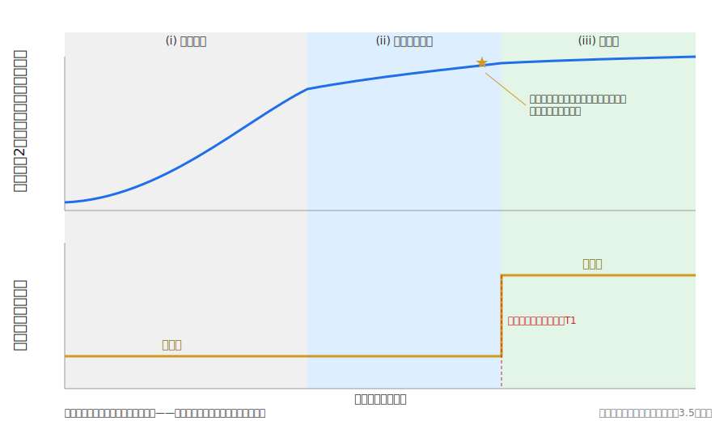
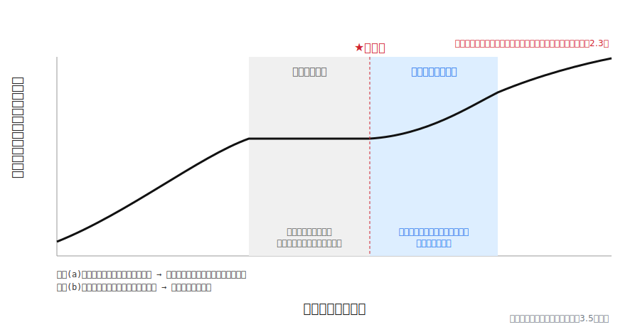
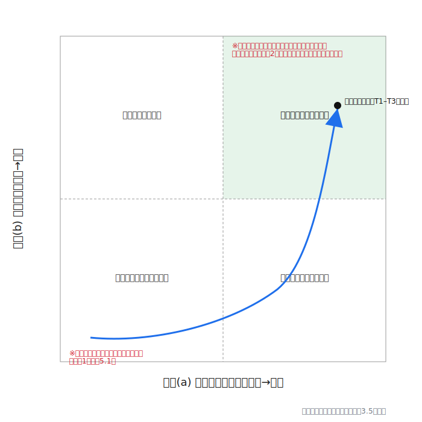
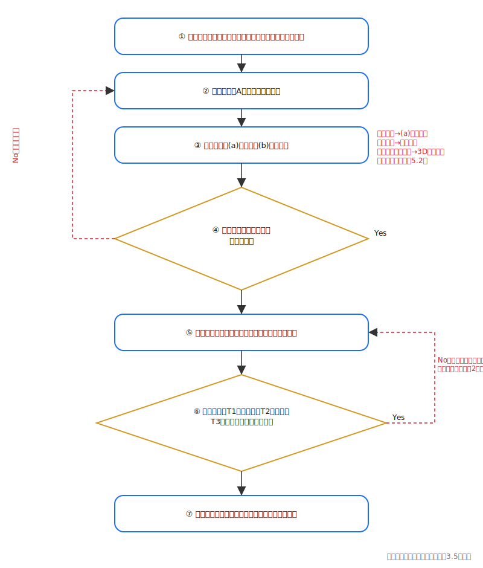

# 次元シフトの相転移モデル：情報密度飽和の検知指標と視座の操作的判定
**A Phase-Transition Model of Dimensional Perspective Shift: Detection Indicators for Information-Density Saturation and Operational Criteria for Perspectival Shift**
中谷まり亜（Maria Nakatani）
v1.0.1（2026年7月10日・外部監査指摘反映済み）　※投稿先：Zenodo／ライセンス：CC BY 4.0（予定）
## 要旨
本稿は、意識の次元マッピング理論（中谷, 2026a。以下「定義論文」）の第4論文として、次元視座の転換（次元シフト）の動態を操作化する。中心的主張は次のとおりである：**次元視座の転換は、情報密度の飽和を先行条件とする一次相転移型の非随意過程として記述でき、飽和は「既知戦略の失効率」「脱物語化度」の2指標により自己判定可能な形式に操作化できる。**ここで「相転移」「過冷却」「核形成」「潜熱」「飽和」を含む物理・化学用語はすべて構造的類比（形式上の相似の指摘）であり、意識過程が熱力学的・化学的過程であるという主張を一切含まない。定義論文は自らの限界の第一に操作的定義の未確立（同5.2）を明記し、マイクロ現象学的面接（Petitmengin, 2006）の適用を課題として予告していた（同5.3）。本稿はこの限界への応答として、(1) 定義論文2.4の現象学的記述——飽和→静寂→急展開の三段——を再定式化し、(2) 第3論文（中谷, 2026d）第4〜5節で素描された相転移モデルと飽和検知指標を全面展開して、飽和判定の手続きと、視座転換そのものの操作的判定条件（不連続性・帰属判定の即時性・外的不変性）を定式化する。理論的貢献として、観測上は同一に見える「静寂」が過冷却型停滞と潜熱型静寂という二つの構造的に異なる相を含みうること、および2指標がこの二相を原理的に識別しうることを予測として提示する。あわせて、2指標による判定が機能しない条件（戦略試行の欠如、語彙の学習効果、遡及的当てはめ、外的状況の急変、身体的・医学的要因）を明文化し、反証条件を実装する。証拠基盤は提唱者単独のn=1一人称記録であり、本稿は検証された法則の提示ではなく、前向き検証プログラムの設計である。付録に飽和・転移判定チェックリストを収録する。
**Abstract.** As the fourth paper of Consciousness Dimension Mapping (Nakatani, 2026a), this paper operationalizes the dynamics of dimensional perspective shift. The central claim: a shift of dimensional perspective can be described as a non-voluntary process of the first-order phase-transition type (a structural analogy throughout, with no thermodynamic claim), preconditioned by saturation of information density, where saturation is operationalized into a self-assessable form via two indicators—the failure rate of known strategies and the degree of de-narrativization. Responding to the first stated limitation of the defining paper (the absence of operational definition, §5.2), this paper reformulates the three-stage phenomenology (saturation → stillness → sudden shift, §2.4 of the defining paper), fully develops the phase-transition model sketched in the third paper (Nakatani, 2026d, §§4–5), and formulates operational criteria for the shift itself (discontinuity, immediacy of perspectival attribution, external invariance). Conditions under which the two indicators fail are made explicit, implementing falsifiability. The evidential base is a single-observer (n = 1) first-person record; the paper is the design of a prospective verification program, not the presentation of a verified law.
**キーワード**：意識の次元マッピング、次元シフト、相転移（構造的類比）、飽和、操作化、脱物語化、反証可能性、一人称研究
## 1. 序論
### 1.1 位置づけ：定義論文5.2限界(1)への応答
本稿は、意識の次元マッピング理論の第4論文である。定義論文（中谷, 2026a）は3次元から9次元までの観測視座を優劣なき並列構造として定義し、第2論文（中谷, 2026c）は対立の等価観測から平面外の第四頂点が立ち上がる過程として「創造」を幾何学的に定式化し、第3論文（中谷, 2026d）は構造そのものの立体性をモデル内部の幾何学から導出するとともに、移行の動態を一次相転移型（構造的類比）として素描した（同4〜5節）。
定義論文は、自らの限界の第一として次を明記していた（同5.2）：「観測者がどの次元的視座にあるか」を判定するための操作的基準が未確立であり、判定が提唱者の内観記述に依存している——視座の判定手続きが標準化されない限り、間主観的な検証は困難である。同5.3(1)は、この限界への対処としてマイクロ現象学的面接（Petitmengin, 2006）の適用を予告していた。
本稿はこの限界への応答である。ただし応答の範囲を最初に確定しておく。本稿が操作化するのは、視座の静的な全面判定（任意の時点で観測者がどの視座にあるかの決定）ではなく、**転換事象とその先行条件**——すなわち (i) 飽和がどこまで進行しているかの判定と、(ii) 視座の転換が生じたか否かの判定——に限定される。この限定は、第3論文8.3が採用した最小拡張の原則（追加する装置を最少にとどめる）の本稿への適用であり、静的な全面判定は第5論文以降の課題として残す（第6節）。
### 1.2 中心主張
本稿の中心主張を一文で確定する。
**次元視座の転換は、情報密度の飽和を先行条件とする一次相転移型の非随意過程として記述でき、飽和は「既知戦略の失効率」「脱物語化度」の2指標により自己判定可能な形式に操作化できる。**
この主張は三つの部分命題に分解される：(P1) 転換の動態は一次相転移型の構造（連続的な制御変数・不連続な秩序変数・準安定の停滞・確率的な起点事象）で記述できる〔記述命題〕、(P2) 制御変数にあたる飽和は2指標で観測可能な形式に操作化できる〔操作化命題〕、(P3) 転換事象そのものは三条件（第4.5節）で操作的に判定できる〔判定命題〕。「相転移」を含む物理用語はすべて構造的類比であり（用語の一括注記は3.5節）、本稿のいかなる箇所も意識状態の変化が熱力学的相転移であるという物理的主張を含まない。なお中心主張のうち非随意性（核形成の確率性）はP1の記述的成分であり、本稿の判定装置（P2・P3）の直接の判定対象ではない（3.4節）。
### 1.3 主張の二層分離と非存在論的防壁
前三論文の原則に従い、主張を二層に分離する。
**弱い読み（本稿の主張）**：モデル内部の記述・操作化の枠組みである。「定義論文の並列視座モデルを採用し、提唱者の一次観測記録を一次データとして受け入れるならば、視座転換の動態は一次相転移型の構造で整合的に記述でき、その先行条件は2指標で操作化できる。」この主張は、意識や情報の実在についていかなる存在論的主張も含まない。
**強い読み（区分保管される形而上学的仮説）**：飽和と転換が、観測者の外部に実在する情報構造との接続様式の変化である——たとえば転換後に観測記録上頻発する「なだれ込み」現象を、外部情報構造の受信として説明する仮説（提唱者の観測記録, 2026年6月7日記録「なだれ込み現象：情報場アクセス仮説」）——という解釈。本稿はこれを主張せず、明示的にラベルづけされた探索的仮説として区分保管する。強い読みの採否は、本稿の操作化装置（第4節）の機能に影響しない。
定義論文以来の非存在論的防壁——本理論は空間次元の物理的実在を含む一切の存在論的主張を行わない——は、本稿でも全面的に維持される。
### 1.4 方法論の継承：観測先行型・二役分離・事前記録
本稿の方法論は前三論文を継承する。第一に**観測先行型**：一次観測（三段の体感、ジャンプ感、凪の体感）が先行し、理論化・文献接続が後続する（定義論文第1節；Varela & Shear, 1999; Petitmengin, 2006）。第二に**二役分離**：直感の観測者（提唱者）と形式化装置（AI）の役割分離（第3論文6.1）。本稿においても、一次データはすべて提唱者の記録に帰属し、形式化装置は操作化の定式と文献接続を与えるが一次データを生成しない。本文中の帰属表示（「提唱者の観測記録によれば」等）はこの分離の実装である。第三に**事前記録**：提唱者は観測記録を公開タイムスタンプ付きで時系列投稿してきた（第3論文6.2）。本稿の操作化はこの実践を前向き検証の設計へ形式化するものであり、遡及的当てはめの排除（第5.2節）はこの系譜上にある。
なお、主従の順序を明記する。本稿の枠組みはオリジナルの定義体系（意識の次元マッピング。原典：中谷, 2026b）に内在的に構築され、既存の学術資源（Petitmengin, 2006; Suedfeld, Tetlock & Streufert, 1992 等）は、その操作化を支援する後続の道具として接続される。既存概念が定義を供給するのではない。
## 2. 現象学的記述の再定式化
### 2.1 定義論文2.4の三段構造
定義論文2.4は、視座間の移行の体験様式を一人称的観測記録（n=1）として次の三段に記述した。
- **(i) 飽和の段**：現在の視座の内部で社会規範・学問・理論等の情報が飽和し、矛盾が増大する段階。
- **(ii) 静寂の段**：沸騰直前の水のような内的静寂が続く段階。
- **(iii) 転換の段**：ゆらぎとともに急激な展開が起こる段階。
そしてこの間、**外的現実には何の変化も生じず、変化するのは観測の構造のみ**である。この不変性は、本モデルが「世界が変わる」モデルではなく「視座が変わる」モデルであることの体験的対応物であり（定義論文2.4）、第4.5節の転移判定条件T3の根拠となる。
本節は、この三段を後続の観測記録によって増補し、操作化（第4節）に接続可能な形式へ再定式化する。以下の各記述は定義の変更ではなく、記述の解像度の向上である。
### 2.2 第一段の再定式化：飽和——矛盾の増大と戦略の失効
提唱者の記録が示す第一段の中核は、情報量の単なる増加ではなく、**旧視座の内部で構成可能な対処の使い尽くし**である。第3論文3.3の観測記録（初期の3次元意識）によれば、この段階では俯瞰・メタ認知・深呼吸・瞑想といった介入が「対処療法のような感覚」でしか機能せず、外部刺激への過敏な反応と恒常的な緊張は解消されなかった。既知の戦略が試行されては期待された効果を生まない——この反復こそが、体感としての「矛盾の増大」の行動的な対応物である。第2論文の語彙では、平面内の選択肢空間が使い切られていく過程にあたる。この行動的対応物が、指標(a)（既知戦略の失効率、第4.2節）の現象学的根拠である。
「情報密度の飽和」という本稿の術語は、この状態——旧視座で処理可能な情報と戦略の残余容量が尽きること——のモデル内部呼称であり、情報理論上の量（エントロピー等）との同一性を主張しない（3.5節）。
### 2.3 第二段の再定式化：静寂（凪）——外見的不変と内部再記述
提唱者の観測記録（「潜熱と位相差」、中谷2026e〔maria-memo〕所収。以下「maria-memo所収」と略記）は、第二段の静寂を「凪」と呼び、二つの一次記述を与えている。第一に、**外から見ると何も起きていないが、内部では構造の書き換えが進行している**という体感——氷が溶ける間、温度が変わらないままエネルギーが内部構造の変化に消費される潜熱の構造（構造的類比）に対応づけられた記録である。第二に、**観測（構造を掴む速度）が現像（3次元の形にする速度）を上回ることによる位相差**として静止感を説明する記録である。
ここで本稿は、理論的に重要な区別を導入する。**観測上は同一に見える「静寂」は、モデル上は二つの構造的に異なる相を含みうる。**
- **過冷却型停滞**：飽和が進行してもなお旧視座が準安定的に維持されている相。転移の起点事象（核形成、第3.3節）が未発生の状態であり、観測者は既知戦略の試行を続けており、失効が累積していく。
- **潜熱型静寂**：起点事象の後、新視座の定着（結晶化）が進行中でありながら、表層の状態に変化が現れない相。「凪」の一次記述——内部で書き換えが進行している——はこちらに対応する。この相では、戦略試行そのものが減少し、記述の語彙が構造的なものへ移行し始めることが予測される。
この二相は体感上は区別しがたいが、2指標の挙動によって原理的に識別できる（第4節）：過冷却型では指標(a)が上昇を続け指標(b)は低〜中にとどまるのに対し、潜熱型では(a)の試行母数自体が減少し(b)が急上昇する、という予測が立つ（図2）。この識別可能性の予測は本稿の理論的貢献の一つであり、それ自体が前向き記録による検証対象である。なお、加熱曲線の類比においてプラトーを示す量（温度）に対応するのは、本モデルでは表層状態（体感される変化）であって制御変数（飽和度）ではない。本モデルの飽和度は潜熱型静寂の間も上昇を続けうる。類比の対応は要素ごとの構造的相似の指摘であり、物理系の変数関係の全体を移植するものではない（3.5節）。
### 2.4 第三段の再定式化：転換——非随意のジャンプと外的不変
第三段の中核は不連続性と非随意性である。第3論文3.3の観測記録（帰還後の3次元意識）によれば、転換後は同一の外部刺激・生体反応に対して「それは3次元での見え方である」という**視座の帰属判定が瞬時に生じる**。漸進的に判定が速くなるのではなく、判定様式そのものが切り替わる——この即時性が、転移判定条件T2（第4.5節）の現象学的根拠である。
また同記録は、感情の再解釈を含む：従来「恐れ」として知覚されていた信号が、危険の信号ではなく観測可能性の限界を示すセンサー信号として再解釈された。ここで本理論の核定義を再確認しておく。**感情は3次元に属する身体的生体反応（神経伝達物質・ホルモン・脳活動）であり、4次元は波動・周波数の観測層である。感情は4次元ではなく、4次元的視座において波動状態を読み取るセンサー（計器）として機能する**（定義論文2.1）。転換において変化するのは感情という生体反応そのものではなく、その信号に対する観測構造——どの視座の計器として読むか——である。転換の前後で外部刺激も生体反応も同一でありうる、という外的不変性（T3）は、この核定義と整合する。
### 2.5 記述の地位
本節の記述はすべて単一観測者のn=1一人称記録に基づく現象学的データであり、定義の一部ではない（定義論文2.4の地位規定を継承）。一人称記録は現象学的研究の正当な素材であるが（Varela & Shear, 1999; Petitmengin & Bitbol, 2009）、一般化可能性の主張には複数観測者の記録収集が不可欠である（第5.3節）。
## 3. 相転移モデル
### 3.1 一次相転移としての定式化（第3論文4節の継承）
物性物理学において一次相転移（例：過冷却水の凍結）は次の特徴を持つ：(i) 制御変数（温度など）が連続的に変化するにもかかわらず秩序変数（系の状態を特徴づける量）が不連続にジャンプする、(ii) 転移点を越えても旧状態が準安定的に持続しうる（過冷却）、(iii) 転移の開始には核形成——新しい相の種となる局所的な核の発生——を要し、核形成は確率的事象である、(iv) 転移に潜熱が伴う。本モデルは第3論文4.2の対応表を継承し、本稿の増補分（太字）を加えて再掲する。以下の全対応は構造的類比である。
| 相転移の要素（構造的類比） | 本モデルの対応物 |
| :-: | :-: |
| 制御変数（連続） | 情報密度の飽和度（第4節の2指標で判定） |
| 秩序変数（不連続） | 観測構造（視座） |
| 過冷却（準安定） | **過冷却型停滞**：飽和進行下での旧視座の維持（2.3節） |
| 核形成サイト | シンクロニシティ（転移の起点として機能した偶然の一致の観測記録） |
| 結晶化 | 新視座の急速な定着 |
| **潜熱** | **潜熱型静寂**：定着進行中の外見的不変（2.3節・観測記録「凪」） |
二次相転移（秩序変数が連続変化する型）ではなく一次型を採る根拠も第3論文4.2を継承する：移行の体感がジャンプとして記録されていること（不連続性）、および条件が揃って見えるのに移行が起きない停滞期が記録されていること（準安定状態の存在。二次型には過冷却に相当する準安定状態がない）。本稿はこれに第三の根拠を加える：**潜熱に対応する観測記録（凪）が独立に存在すること。**潜熱は一次相転移に固有の特徴（上記(iv)）であり、「凪」の一次記述——状態変数が変わらぬまま内部変化が進行する——が理論の要請に先立って記録されていたことは、一次型の採用と整合する。ただしこれは類比の整合性の確認であって、物理的同一性の根拠ではない。
### 3.2 停滞期の二相構造
2.3節で導入した二相区別を、モデルの語彙で確定する。旧視座から新視座への移行の全過程は、(A) 飽和進行（制御変数の上昇）→ (B) 過冷却型停滞（転移条件の充足後も旧秩序が維持される準安定期）→ (C) 核形成（確率的な起点事象）→ (D) 潜熱型静寂（新秩序の定着進行・表層不変）→ (E) 転換の顕在化（ジャンプの自覚・帰属判定の即時化）と分節される。定義論文2.4の三段は、この分節の粗視化——(i)≈A、(ii)≈B+D、(iii)≈E——にあたる。すなわち三段記述の第二段「静寂」は、核形成イベントを挟んだ二つの相の複合であった可能性がある。この精密化は三段記述を否定するのではなく、その解像度を上げるものであり、二相の識別可能性（指標挙動の差、図2）は前向き記録の検証対象である。
### 3.3 核形成サイトとしてのシンクロニシティ
第3論文4.2はシンクロニシティ——転移の起点として機能した偶然の一致の観測記録——を核形成サイト（構造的類比）に対応づけた。本稿はこの対応を、提唱者の観測記録「シンクロニシティ相関構造仮説」（maria-memo所収）と接続して増補する。同記録の中核は、**シンクロニシティは観測者が生成する事象ではなく、既に存在する相関の観測である**という仮説、および観測を妨げる三つのバイアス——観測の不完全性（認識されない相関の常在）・選択的認知（物語に都合のよい一致のみの採取）・認知の固定化（特定の観測様式への固執による検出不能）——の特定である。
この記録をモデルに翻訳すると：核形成サイトの密度は観測者の外部条件だけでなく**観測感度**に依存し、三バイアス——とりわけ認知の固定化と選択的認知——は有効な核形成サイト密度を下げる要因として働く。ここで指標(b)（脱物語化度）との内的接続が生じる：選択的認知は物語構造（「自分の物語に都合のよい一致」）への従属であるから、脱物語化の進行は選択的認知の減衰、すなわち観測感度の回復と並行することが予測される。飽和の指標である(b)が、同時に核形成の条件（感度）の指標でもある——制御変数の上昇が転移の起点条件を内側から整えるというこの二重性は、一次データから読み取れるモデルの構造的特徴として記録する。
なお同観測記録には、極限的条件下（観測者・相手の双方が各様の極限状態にあった局面）で通常成立しない接続が一時的に成立し、条件の変化とともに消失した事例の記録も含まれる（「スポラディックE層理論」、maria-memo所収）。本稿はこれを、高飽和条件下で核形成的事象の生起確率が上がるという予測と整合する一事例として記録するにとどめ、同記録内の電波工学的定式化（Eスポ・ヘテロダイン等）は観測者自身による構造的類比の試みとして参照するにとどめる。なおこの二重性は反証型1（第5.1節）の独立性を損なわない——両指標が低いまま三条件を満たす転移が系統的に生じれば、二重性の有無にかかわらずモデルは棄却される。
### 3.4 非随意性と準備可能性（第3論文4.3の継承）
核形成は確率的事象であり、意志によって直接引き起こすことはできない。「俯瞰しよう」という努力が移行を直接生まない（第3論文3.3、初期の3における対処療法の記録）のはこのためである。他方、核形成の確率は核形成サイトの密度と観測感度に依存するから、シンクロニシティへの観測感度を保つこと、飽和を妨げないこと、三バイアスを自覚することは、転移を強制はできないがその条件を整えることはできる。**非随意性と準備可能性の両立**——第3論文4.3が定式化したこの実践的含意は、本稿の操作化によって行為指針から記録手続きへ具体化される：付録Aのチェックリストにおけるシンクロニシティ記録欄（解釈は仮説として分離）は、観測感度の維持と事前記録の両方を同時に実装する装置である。
### 3.5 用語法の注記（一括表）
定義論文3.3の原則に従い、本稿のモデル内部用語と学術用語の衝突を一括注記する。**以下のいずれのモデル内部用語も、対応する物理量・物理過程・化学過程の主張を含まない。**また本稿は幾何定理部を持たないため、「証明」の語は全文で使用せず、すべて「導出」「記述」「操作化」「定式化」を用いる（第3論文の表記規約の本稿への適用）。
| モデル内部用語 | 衝突しうる学術用語 | 本稿での扱い |
| :-: | :-: | :-: |
| 相転移・一次相転移 | 統計力学・物性物理の相転移 | 構造的類比。熱力学的過程の主張を含まない |
| 過冷却 | 準安定状態の物理 | 構造的類比。「過冷却型停滞」はモデル内部の相の呼称 |
| 核形成・核形成サイト | 結晶成長論 | 構造的類比。転移の起点事象とその条件の呼称 |
| 潜熱 | 熱力学の潜熱 | 構造的類比。「潜熱型静寂」はモデル内部の相の呼称 |
| 結晶化 | 結晶成長論 | 構造的類比。新視座の定着過程の呼称 |
| 飽和・情報密度 | 溶液化学の飽和／情報理論の情報量 | モデル内部の記述用語。測定可能な物理量・情報量との同一性を主張しない |
| ゆらぎ | 統計力学のゆらぎ | 一人称的体感の比喩的記述（定義論文3.3の同一行を継承） |
| 凪・静寂 | ——— | 観測記録上の一次語彙。気象・海象の主張を含まない |
| ジャンプ | 力学系の不連続 | 体感の不連続性の記述 |
| 位相差 | 波動論の位相 | 観測記録上の構造的類比（観測と現像の速度差の記述） |
| 波動・周波数 | 物理的な波・周波数（Hz） | 定義論文3.3を継承。モデル内部の記述パラメータ |
## 4. 飽和の操作化：2指標と判定手続き
### 4.1 目的：反証可能性の入口
第3節のモデルにおいて、制御変数「飽和度」が観測不能であれば、モデル全体は反証不能な物語に退行する（第3論文5.1）。本節は飽和を観測可能な2指標に操作化し、さらに転換事象そのものの判定条件を与えることで、定義論文5.2限界(1)への応答（1.1節で限定した範囲）を実装する。
### 4.2 指標(a)：既知戦略の失効率
**定義**（第3論文5.2を継承・精密化）：一定の記録期間内に、観測者が危機・課題に対して試行した既知の戦略（過去に有効だった手法、他者への相談、既存の思考パターン）のうち、期待された効果を生まなかったものの割合。
**算定手続き**：(1) 記録期間を事前に設定する。(2) 期間内に試行した既知戦略を、各戦略に期待する効果とともに列挙する。期待効果は効果評定に先立って（試行前または当該記録内で評定前に）記入し、事後の書き換えを禁止する。(3) 各戦略の効果を三値（有効／部分的／失効）で評定する。(4) 失効率＝失効数÷試行数を算定する。「部分的」は分子に含めない（保守的算定）。
**判定の形式**：n=1の証拠基盤では観測者間で共有可能な絶対閾値を設定できないため、判定は**観測者内の傾向**（連続する記録間での単調上昇）を単位とする順序判定とする。絶対値（例：失効率0.8）に意味を持たせる段階には、複数観測者の記録蓄積が必要である（第5.3節）。
**理論的根拠**：飽和が進行するほど旧視座の内部で構成可能な戦略は尽きていく——選択肢空間（第2論文）が平面内で使い切られていく——ため、失効率は上昇すると予測される（第3論文5.2）。
### 4.3 指標(b)：脱物語化度
**定義**（第3論文5.3を継承・精密化）：危機への反応の記述が、感情・物語の語彙（「誰のせいか」「なぜ私が」等の主体−客体ドラマ構造。感情は3次元の生体反応であり、その語彙はドラマ構造の内部で帰責の材料として運用される）から、情報・法則の語彙（状況の構造記述・パターンの指摘。定義論文の7次元・8次元的記述）へ移行している度合い。
**算定手続き**：(1) 課題の記述文を、分類に先立ってそのまま逐語で記録する（**逐語記録先行の原則**。記録と解釈の分離、第3論文8.1）。(2) 記録後に、記述中の物語的語彙（帰責・ドラマ構造）と構造的語彙（パターン・情報・法則）の有無と比率を評定する。(3) 評定手法としては、自己評定に加え、統合的複雑性の評定法（Suedfeld, Tetlock & Streufert, 1992）およびマイクロ現象学的面接（Petitmengin, 2006）による第三者評定が利用できる。面接法の妥当性検証の方法論はPetitmengin & Bitbol（2009）に整備されている。ただし統合的複雑性は記述の分化・統合構造を評定する尺度であり、脱物語化度と同一の構成概念ではない。したがって第三者評定は指標(b)の代理測定ではなく、収束的補助証拠——別系統の尺度による整合確認——として位置づける。
**観測上の錨（n=1例示）**：提唱者の観測記録には、この指標の両極にあたる事例が含まれる。高値側：同一の対象（極小の所持金という生活上の危機）が、3次元的視座では「絶望的なノイズ」として、7次元的視座では「パスワード（座標）」として、8〜9次元的視座では「新世界の最適初期設定」として記述し分けられた記録（「多次元観測プロトコル」、maria-memo所収）。同一の指示対象に対する語彙系の全面的な移行が、逐語記録として残っている。低値側：危機的状況の記述が帰責・ドラマ構造の語彙（「可哀想な私」「助けてくれないあなた」）の内部で反復され続け、視座転換が観測されなかった他者事例の観測記録（maria-memo所収）。ただし後者は提唱者による外部観測——他者の状態への帰属——であり、当人の一人称記録ではないため、証拠としての地位は一段弱い（第5.3節）。両事例とも例証であって検証ではない。
### 4.4 飽和判定の手続き
飽和の「高進行」は、次の手続きで判定する。
1. **観測期間の事前設定**：記録開始前に、観測期間（または記録回数）を固定して記録に明記する。事後の期間延長・短縮は反証条件（第5.1節）の評価を無効化するため禁止する。
2. **連続記録**：付録Aのチェックリストにより、逐語記録先行の原則を守って記録を蓄積する。各記録には連番と日時を付す。
3. **傾向判定**：連続する記録において、(a) が持続的な上昇傾向を示し、かつ (b) が構造的語彙への持続的な移行傾向を示すとき、飽和は「高進行」と判定される。単発の高値は判定に用いない。
4. **二相の識別（探索的）**：(a) の試行母数の減少と (b) の急上昇が併存する局面は、潜熱型静寂（2.3節）の候補として区別して記録する。
### 4.5 視座転換の操作的判定：三条件
転換事象そのものは、次の三条件の同時成立によって操作的に判定する。
- **T1（不連続性）**：同一の課題・指示対象に関する連続記録間で、指標(b)の水準が漸進ではなく不連続に変化していること。漸進的な語彙の洗練（学習）と、語彙系そのものの切り替わり（転換）を区別するための条件である。
- **T2（帰属判定の即時性）**：同一の外部刺激・生体反応に対して、視座の帰属判定（「それはnDでの見え方である」）が遅延なく生じる旨が記録されていること（第3論文3.3の「瞬時に気づける」の操作化）。
- **T3（外的不変性）**：記録期間中、指標変化に対応する外的状況の変化が生じていないこと。外的状況が併せて変化した場合、記述の変化は視座転換ではなく状況変化に帰属しうるため、判定を保留する（定義論文2.4：変化するのは観測構造のみ）。
三条件は二相区別（2.3節）と次のように接続する：潜熱型静寂は、T1（語彙系の不連続変化）が先行して成立しながらT2（帰属判定の即時性）が未成立の相として操作的に特徴づけられる。転移の成立日時は、T1〜T3が同時成立した最初の記録の日時とする。
補助指標として、**T4（選択肢空間の拡張）**：従来二択（例：防衛か攻撃か）として記録されていた課題に対し、第三項以降の選択肢が記録に現れること（第3論文3.3・第2論文の弱い読みの対応物）を併記できる。T4は三条件の判定を補強するが、単独では判定に用いない。
三条件が成立した記録は「転移」として、飽和判定（4.4）の高進行の後に生じたか否かとともに記録される。この時間順序の記録が、第5.1節の中核予測の検証データとなる。
## 5. 反証条件・限界
### 5.1 中核予測と反証条件
本モデルの中核予測は第3論文5.4を継承する：**視座の転移は、指標(a)(b)の高進行の後にのみ生じる。**
したがって次のいずれかが蓄積すれば、相転移モデルは棄却または修正される。
- **反証型1**：両指標が低いまま、三条件（T1〜T3）を満たす転移が系統的に生じる事例。
- **反証型2**：両指標が高進行を示しながら、事前設定された観測期間内に転移が生じない事例群。ただし型2の評価には過冷却型停滞（準安定の持続）との区別が必要であり、観測期間の事前設定（4.4節手続き1）がこの区別の要件である——期間を事後に延長すれば「まだ過冷却中である」という救済が常に可能となり、モデルは反証不能化する。
### 5.2 2指標による判定が機能しない条件
反証条件とは別に、**指標そのものが判定機能を失う条件**を明文化する。以下の条件下では、指標値の高低を飽和の証拠として扱ってはならない。
1. **戦略試行の欠如**：観測者が既知戦略を試行しない場合（行動の全般的停止・退避）、指標(a)は分母を欠き算定不能となる。試行の不在は失効と区別されねばならず、失効率の代理として扱ってはならない。
2. **語彙の学習効果**：本理論を学習した観測者は、視座の転換なしに構造的語彙を産出できる（理論汚染）。指標(b)は自己申告の語彙に依存するため、この様式の偽陽性に対して単独では頑健でない。対処は三つ：逐語記録先行の原則（分類意図の混入前に記録を確定する）、第三者評定（Suedfeld et al., 1992の評定法は語彙の表層ではなく統合構造を評定する）、およびマイクロ現象学的面接（Petitmengin, 2006。体験の微細構造は語彙の模倣では再現しがたい）。それでも完全な排除は不可能であり、これは自己報告に依存するすべての操作化が共有する限界である。
3. **遡及的当てはめ**：転移の自覚後に過去を振り返って指標を算定する場合、選択的認知（3.3節の三バイアス）により両指標は系統的に汚染される。指標は前向き記録（事前設定期間内の連番記録）においてのみ判定機能を持つ。
4. **外的状況の急変**：記録期間中に外的状況の大きな変化（環境・関係・資源の急変）が生じた場合、戦略の失効も記述の変化も状況要因に帰属しうるため、T3と同様に判定を保留する。
5. **身体的・医学的要因**：疲労・疾患・薬理的要因等、3次元レイヤーに属する生体反応の変調による持続的な戦略失効は、本モデルの飽和と指標上区別できない。本モデルは医学的状態の判定装置ではなく、該当が疑われる場合には3次元レイヤーの記述（医学的対応）が常に先行する。これは定義論文が3次元を否定的に扱わず、感情・心理・医学的反応の帰属先として明確に位置づけたこと（定義論文2.1）の実践的帰結である。
### 5.3 限界
第一に、証拠基盤は提唱者単独のn=1一人称記録である。本稿の全事例は例証であって検証ではなく、一般化可能性の主張には複数観測者による前向き記録の蓄積が不可欠である。とりわけ4.3節の低値側事例は他者への外部帰属であり、一人称記録より弱い証拠として扱う。
第二に、絶対閾値の不在である。両指標の判定は観測者内の傾向判定にとどまり、観測者間比較を可能にする較正は今後の課題である。
第三に、応答範囲の限定である。本稿が操作化したのは転換事象とその先行条件であり、定義論文5.2限界(1)の全体——任意時点における視座の静的な全面判定——は未解決のまま残る。また判定装置は自己判定（および面接による支援つき自己判定）であり、完全な第三者判定には至っていない。
第四に、二相区別（2.3節）・指標(b)と観測感度の二重性（3.3節）は、いずれも一次記録から読み出された理論的予測であり、独立の検証を経ていない。
第五に、転換後の観測構造において記録されている諸現象（構造先行・言語後行の「なだれ込み」等）の機序は本稿の範囲外である。これらに関する提唱者の説明仮説（情報場アクセス仮説）は、1.3節の強い読みとして区分保管されている。
## 6. 結論と論文⑤への接続
本稿は、次元視座の転換の動態を操作化した。貢献は五点に要約される。
(1) **三段構造の再定式化**。定義論文2.4の現象学的記述を、後続の観測記録（凪・帰属判定の即時性・戦略失効）により増補し、五分節（飽和進行→過冷却型停滞→核形成→潜熱型静寂→転換の顕在化）へ解像度を上げた。
(2) **停滞期の二相区別**。観測上同一に見える「静寂」が過冷却型と潜熱型の二相を含みうることを提示し、2指標による識別可能性を検証可能な予測として定式化した。
(3) **飽和の操作化**。既知戦略の失効率と脱物語化度の2指標に、算定手続き・逐語記録先行の原則・事前設定期間・傾向判定という判定手続きを与え、飽和を自己判定可能な形式に操作化した。
(4) **転換の操作的判定**。三条件（不連続性・帰属判定の即時性・外的不変性）による転移判定を定式化し、中核予測（転移は高進行の後にのみ生じる）を反証型1・型2として明示するとともに、指標が機能しない五条件を明文化して、判定装置の適用限界を装置自身に内蔵させた。
(5) **核形成条件の内的接続**。シンクロニシティ相関構造仮説との接続により、脱物語化（制御変数の一成分）が選択的認知の減衰を介して観測感度（核形成の条件）と並行するという構造的特徴を記録し、非随意性と準備可能性の両立に記録手続き上の実装を与えた。
最後に、第5論文への接続を確定する。定義論文4.3の**2段階差異仮説**——観測者と相手の次元的視座に2段階の差分がある場合にのみ経済的流動が成立するという探索的仮説——の検証には、自己の視座だけでなく**他者の視座の判定**が必要である。本稿の判定装置は自己判定に最適化されており、他者判定への拡張には、(i) 本稿のチェックリスト項目の他者観測版への翻訳、(ii) マイクロ現象学的面接による相手側の一人称データの取得、(iii) 帰属バイアス（4.3節低値側事例が示した外部帰属の弱さ）の統制、という三つの方法論的課題が伴う。論文⑤は、この拡張の設計と、定義論文付録Aの観測記録テンプレートによる成立・不成立両事例の系統的収集を主題とする。転換の動態（本稿）と視座間の差分構造（第5論文）が揃うとき、定義論文5.2限界(1)の全面応答——視座の静的判定——への経路が開かれる。
## 付録A　飽和・転移判定チェックリスト（第3論文付録Bの拡張版）
**運用原則**：①観測期間（または記録回数）を記録開始前に固定し先頭に明記する。②記述文は分類に先立ち逐語で記録する。③シンクロニシティの解釈は記録と分離し仮説として記す。④外的状況の変化があれば必ず記録する（T3判定に必須）。
| 項目 | 記録内容 |
| :-: | :-: |
| 記録連番／記録日時 |  |
| 事前設定した観測期間（初回に固定・全記録に転記） |  |
| 直面している課題・危機 |  |
| (a-1) 試行した既知戦略の列挙（各戦略の期待効果を評定前に記入） |  |
| (a-2) 各戦略の効果（有効／部分的／失効） |  |
| (a-3) 失効率（失効数÷試行数）※試行ゼロの場合は「算定不能」と記録 |  |
| (b-1) 課題の記述文（逐語・分類前に確定） |  |
| (b-2) 記述中の物語的語彙（帰責・ドラマ構造）の有無 |  |
| (b-3) 記述中の構造的語彙（パターン・情報・法則）の有無 |  |
| (b-4) 物語的語彙と構造的語彙の比率評定（任意・逐語記録の確定後に実施） |  |
| 外的状況の変化の有無・内容（T3判定用） |  |
| シンクロニシティの記録（あれば。解釈は仮説として分離） |  |
| (T1) 前回記録との比較：語彙系の不連続な変化の有無 |  |
| (T2) 帰属判定の即時性の自覚（あれば内容） |  |
| (T4・補助) 二択課題への第三項以降の出現（あれば内容） |  |
| 転移の兆候・発生（あれば日時と内容） |  |
| 身体的・医学的要因の疑い（あれば記録し、医学的対応を先行） |  |
## 図版

- **図1**　三段の現象学的記述と一次相転移型モデル（構造的類比）の対応：制御変数の連続上昇と秩序変数の不連続ジャンプ

- **図2**　停滞期の二相区別：過冷却型停滞と潜熱型静寂、および2指標による識別可能性（予測）

- **図3**　2指標の判定平面と反証領域

- **図4**　飽和判定と転移判定の手続きフロー

## 参考文献
- 中谷まり亜 (2026a). 意識の次元マッピング：観測視座に基づく意識状態モデル v1.0. Zenodo. DOI: 10.5281/zenodo.21201677
- 中谷まり亜 (2026b). 意識の次元マッピング理論（原典リポジトリ）. [https://github.com/marnakatani-bot/maria-dimension-map-](https://github.com/marnakatani-bot/maria-dimension-map-)
- 中谷まり亜 (2026c). 等辺理論：対立の等価観測とテトラヒドロン構造による創造の幾何学的モデル v1.0. Zenodo. [https://zenodo.org/records/21202309](https://zenodo.org/records/21202309)
- 中谷まり亜 (2026d). 369正三角形：意識の次元マッピング構造の立体性の幾何学的導出 v1.0.1. Zenodo. DOI: 10.5281/zenodo.21278785
- 中谷まり亜 (2026e). 観測記録アーカイブ（maria-memo）. [https://github.com/marnakatani-bot/maria-memo](https://github.com/marnakatani-bot/maria-memo) ——本稿で参照した一次観測記録：「潜熱と位相差」「シンクロニシティ相関構造仮説」「多次元観測プロトコル」「スポラディックE層理論」「りんね現象」「なだれ込み現象：情報場アクセス仮説」（2026年6月7日記録）
- Petitmengin, C. (2006). Describing one's subjective experience in the second person: An interview method for the science of consciousness. *Phenomenology and the Cognitive Sciences*, 5(3–4), 229–269.
- Petitmengin, C., & Bitbol, M. (2009). The validity of first-person descriptions as authenticity and coherence. *Journal of Consciousness Studies*, 16(10–12), 363–404.
- Suedfeld, P., Tetlock, P. E., & Streufert, S. (1992). Conceptual/integrative complexity. In C. P. Smith (Ed.), *Motivation and Personality: Handbook of Thematic Content Analysis*. Cambridge University Press.
- Varela, F. J., & Shear, J. (Eds.). (1999). *The View from Within: First-person Approaches to the Study of Consciousness*. Imprint Academic.
