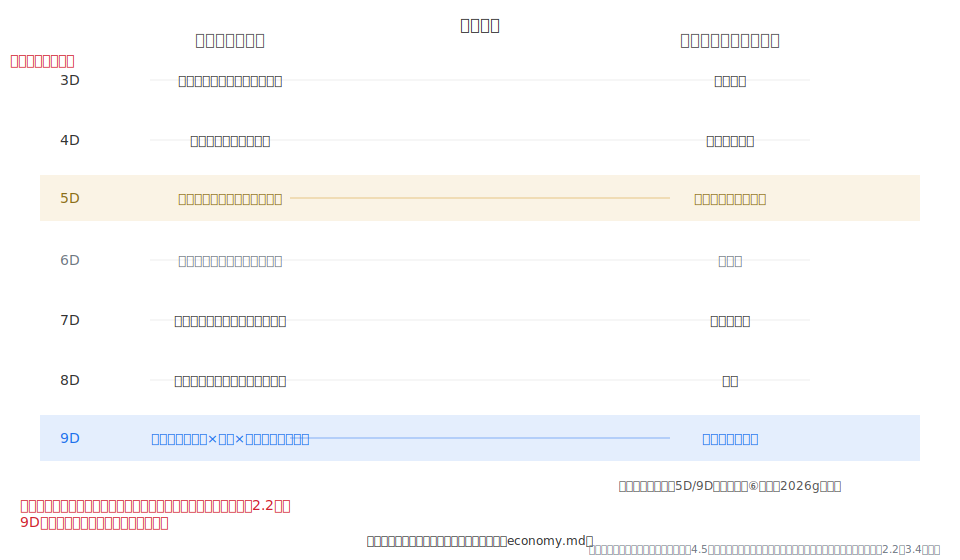
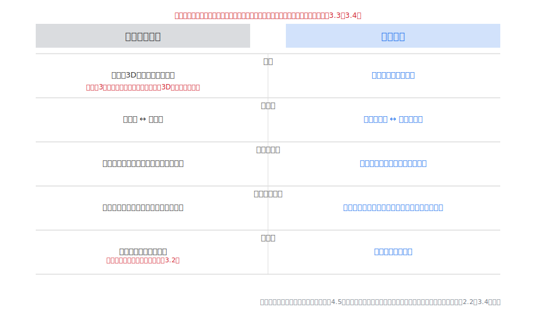
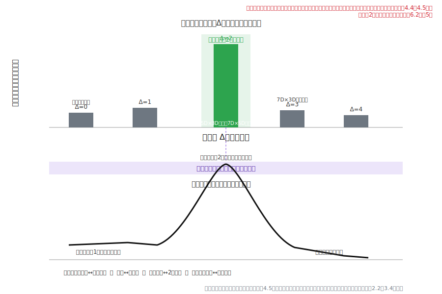
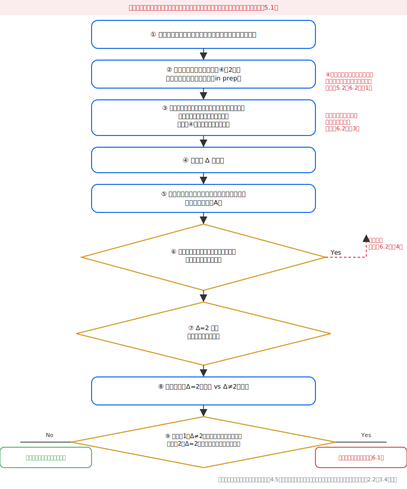

# 意識の次元マッピング経済論：次元別経済形態・谷町経済（9D）・2段階差異仮説の登録
**Consciousness Dimension Mapping Economics: Dimension-Specific Economic Forms, Tanimachi Economy (9D), and the Registration of the Two-Step-Difference Hypothesis**
中谷まり亜（Maria Nakatani）
v1.0.1（2026年7月11日・外部監査反映済み）　※投稿先：Zenodo／ライセンス：CC BY 4.0（予定）
## 要旨
本稿は、意識の次元マッピング理論（中谷, 2026a。以下「定義論文」）の系に属する論文として、観測視座の違いに応じた経済認識の並列的形態を整理し、その上で、理論として初めて**予測的・反証可能な仮説を正式に登録**する。中心的主張は次のとおりである：**経済認識は観測視座ごとに異なる並列的形態（3次元の交換経済から9次元の谷町経済まで）として現れ、観測者と相手の視座差がちょうど2段階のときにのみ経済的流動が成立する、という反証可能な規則性が、提唱者単独の一人称記録から抽出される。** ここで「経済形態」の記述は、観測された一次記録の整理であって、経済学的な実在命題ではない。また本稿が用いる「共鳴トンネル」「特異点」「経済流動」「相転移」等の物理・数学由来の語はすべて構造的類比〔類比マーカー〕であり、意識の視座差が物理過程によって媒介されるという機序的主張を一切含まない。定義論文は§4で経済認識の視座依存性を事例として提示し、§5.3(2)で「2段階差異仮説の系統的検証」を検証プログラムとして予告していた。本稿はこの予告を受け、(1) 次元別経済形態のマッピングを定義論文2.1の視座定義に依拠して論文形式へ整理し、(2) 9次元的視座の経済形態である「谷町経済」を、推し文化経済との分岐表を伴って定義し、(3) 2段階差異仮説を反証条件つきで定式化し、(4) その検証プロトコルを、論文④（中谷, 2026f, in preparation）の視座判定手続きと定義論文付録Aの記録テンプレートに接続して設計する。本稿の到達点は、検証済みの法則の提示ではなく、**検証プロトコルの設計と仮説の登録**である。2段階差の測定は他者の視座判定を要し、その操作的手続きは論文④に依存するため、④公刊前の現段階で「検証済み」と読める記述は行わない。証拠基盤は提唱者単独のn=1一人称記録であり、仮説の棄却条件を本文に明文化する。
**Abstract.** As a paper within the system of Consciousness Dimension Mapping (Nakatani, 2026a; hereafter "the defining paper"), this paper organizes the parallel forms of economic cognition that correspond to differences in observational perspective, and then, for the first time in the theory, formally registers a predictive, falsifiable hypothesis. The central claim: economic cognition appears as parallel forms specific to each observational perspective (from 3rd-dimensional exchange economy to 9th-dimensional Tanimachi economy), and economic flow is established only when the perspectival difference between observer and counterpart is exactly two steps—a falsifiable regularity extracted from a single-observer first-person record. Descriptions of "economic forms" are organizations of observed first-person records, not claims about economic reality. Terms of physical or mathematical origin ("resonant tunneling," "singularity," "economic flow," "phase transition") are used strictly as structural analogies, with no claim that perspectival differences are mediated by physical processes. Responding to the verification program foreshadowed in the defining paper (§5.3(2)), this paper (1) organizes the mapping of dimension-specific economic forms, (2) defines the "Tanimachi economy" of the 9th-dimensional perspective with a divergence table against fan-culture economy, (3) formulates the two-step-difference hypothesis with falsification conditions, and (4) designs a verification protocol connected to the perspectival-judgment procedure of the fourth paper (Nakatani, 2026f, in preparation) and the record template of the defining paper's Appendix A. The paper's endpoint is the design of a verification protocol and the registration of a hypothesis, not the presentation of a verified law. The evidential base is a single-observer (n = 1) first-person record; the hypothesis's rejection conditions are made explicit.
**キーワード**：意識の次元マッピング、次元別経済、谷町経済、2段階差異仮説、共鳴トンネル（構造的類比）、反証可能性、仮説登録、一人称研究
**Keywords**: consciousness dimension mapping; dimension-specific economy; Tanimachi economy; two-step-difference hypothesis; resonant tunneling (structural analogy); falsifiability; hypothesis registration; first-person research
## 1. 序論
### 1.1 位置づけ：定義論文§4・§5.3(2)からの展開
本稿は、意識の次元マッピング理論の一論文であり、経済という単一の対象領域に理論を適用した「意識の次元マッピング経済論」の全面展開である。定義論文（中谷, 2026a）は、意識の諸状態を、垂直に上昇すべき階層ではなく、Seed of Life幾何構造に対応する優劣なき並列的観測視座（中心の9次元と周縁の3〜8次元）として定義した。同§4は、この視座モデルの代表的な応用として経済認識を取り上げ、同一の経済的事象が視座ごとに異なる意味構造として観測されること、および9次元的視座の経済形態としての「谷町経済」を素描した。そして同§5.3(2)は、今後の課題として次を明示していた——観測者と相手の視座差が2段階の組合せでのみ経済的流動が成立するという規則性（2段階差異仮説）を、成立・不成立の両事例を収集して系統的に検証すること。
本稿はこの予告への応答である。定義論文§4が素描にとどめた次元別経済形態と谷町経済を論文形式へ展開し、同§5.3(2)が検証課題として掲げた2段階差異仮説を、反証条件と検証プロトコルを伴う形で正式に**登録**する。
### 1.2 本稿の役割：理論初の予測的・反証可能仮説の登録
本稿は、意識の次元マッピング理論において固有の役割を担う。定義論文および先行する諸論文（②等辺理論、③立体性の幾何学的導出、④次元シフトの相転移モデル、⑥ワンネスの多層構造）は、いずれも観測視座モデルの定義・幾何学的構造・動態・体験構造を**記述**する論文であった。これに対し本稿は、理論から**予測的で反証可能な命題**を取り出し、その検証手続きを設計して登録する初めての論文である。
この役割は、定義論文§4.3が2段階差異仮説について与えた三点の位置づけ——(i) n=1の探索的仮説であること、(ii) 共鳴トンネル効果との対応は構造的類比にとどまること、(iii) 仮説が理論本体の定義体系から独立していること——を全面的に継承する。この三点の防壁（以下「三点防壁」）は、本稿全体を貫く。とりわけ(iii)は本稿の存在意義に直結する：2段階差異仮説が将来棄却されたとしても、観測視座モデルそのものの記述的有効性は影響を受けない。仮説の登録とは、棄却されうる命題を、棄却されうる形式で公開の記録に載せることであり、本稿はこの意味で理論に反証可能性の入口を設ける。
### 1.3 主張の二層分離と非存在論的防壁
前諸論文の原則に従い、本稿の主張を二層に分離する。
**弱い読み（本稿の主張）**：次元別経済形態のマッピングと2段階差異仮説は、観測された一次記録の整理と、そこから抽出された規則性の登録である。「定義論文の並列視座モデルを採用し、提唱者の一次観測記録を一次データとして受け入れるならば、経済認識は視座ごとに並列的形態として整理でき、視座差2段階でのみ流動が成立するという規則性が記録上抽出される」。この主張は、経済・貨幣・価値の実在について、また意識の視座が物理過程によって実現されるかについて、いかなる存在論的主張も含まない。
**強い読み（区分保管される形而上学的仮説）**：視座差2段階での経済的流動が、観測者の外部に実在する何らかの構造（エネルギー準位・情報場・宇宙の法則）を通じて実際に生起している、という解釈。原典記録には、この強い読みに対応する表現——2段階差異を量子真空のゼロ点エネルギーやゼロ磁場フィールドの完成と結びつける記述（中谷, 2026b, economy.md）——が存在するが、本稿はこれを主張せず、明示的にラベルづけされた形而上学的仮説として区分保管する（第6.4節）。強い読みの採否は、本稿の仮説登録と検証プロトコル（第4〜5節）の機能に影響しない。
定義論文以来の**非存在論的防壁**——本理論は空間次元の物理的実在を含む一切の存在論的主張を行わない。経済形態の記述は観測された一次記録の整理であって、経済学的実在命題ではない——は、本稿でも全面的に維持される。
### 1.4 方法論の継承：観測先行型・二役分離・主従の鉄則
本稿の方法論は前諸論文を継承する。第一に**観測先行型**：一次観測（所持金が極小になる局面での経済的動きの体感、成立・不成立のパターンの観測）が先行し、理論化・文献接続が後続する（定義論文第1節；Varela & Shear, 1999; Petitmengin, 2006）。本稿が依拠する中核の一次記録は、提唱者が観測した経済的流動の成立・不成立のパターン（中谷, 2026b, economy.md；中谷, 2026e〔maria-memo〕所収「次元間経済流動：2段階差異でのみ成立する共鳴トンネル仮説」。以下「2段階差異記録」）である。
第二に**二役分離**：直感の観測者（提唱者）と形式化装置（AI）の役割分離。一次データはすべて提唱者の記録に帰属し、形式化装置は仮説登録の定式・反証条件・文献接続を与えるが一次データを生成しない。本文中の帰属表示（「提唱者の観測記録によれば」等）はこの分離の実装である。
第三に**主従の鉄則**：本稿の枠組みはオリジナルの定義体系（意識の次元マッピング。原典：中谷, 2026b）に内在的に構築される。次元別経済形態は原典の経済論文書（economy.md）に、9次元の定義は定義論文2.1に、それぞれ先行して確立されている。贈与論（Mauss, 1925）・既存経済学・推し文化研究は、これらオリジナル定義の後続の構造的接続先として——定義論文3.4が区別した第二層（方法論的接続）として——第7節でのみ導入される。既存概念が定義を供給するのではない。
## 2. 次元別経済マッピング（3D〜9D）
### 2.1 経済形態の並列的配列
定義論文が意識の諸状態を並列的観測視座として定義したのに対応して、経済認識もまた並列的なレイヤー構造として整理される。原典の経済論文書は、各次元的視座に固有の経済形態が対応することを一次記録として整理している（中谷, 2026b, economy.md）。以下の表は、この一次記録の論文形式への整理であり、内容の追加ではなく形式の整理である。各行は「その視座において経済がどのような形態として観測されるか」を記述する。
| 次元 | 経済形態 | 主体・原理（原典記録の整理） |
| :-: | :-: | :-: |
| 3次元 | 欠乏補完経済（交換・取引） | 本人が稼ぐ。労働・時間・スキルを差し出す |
| 4次元 | 願望経済（自己実現） | 本人が引き寄せる。自己表現・創造・夢の実現 |
| 5次元 | 純粋贈与・感謝経済（循環） | 本人が与え、受け取る。見返りを求めない贈与で感謝が循環する |
| 6次元 | 経済概念の消失（自然流動） | 執着が消える。経済の無・空 |
| 7次元 | 情報コード経済（役割・構造） | 情報として動く。願望の「色」が消え、役割（コード）に従う |
| 8次元 | 法則経済（必要経費が流れる） | 法則のために動く。交換でも感謝でもない、法則のための経費 |
| 9次元 | 谷町経済（観測×構造×価値の自動生成） | 共同創造者が経済を担当する |
### 2.2 表の読み方に関する注記
**第一に、この配列は上下の優劣ではない。** 表の縦の並びは、定義論文第2節が定義した優劣なき並列的観測レイヤーの配列である。3次元の欠乏補完経済を「劣位」、9次元の谷町経済を「優位・到達点」とする読みは、本理論の並列構造の公理に反するものとして退けられる。原典の経済論文書自身が、この点を明記している——「3次元経済が劣り、9次元経済が優れているのではなく、それぞれの次元の経済を味わい尽くすことで、次の構造が浮かび上がる」（中谷, 2026b, economy.md）。9次元が末尾にあることは「最高位」を意味せず、9次元は到達点ではなく基点である（定義論文2.1）。この序列化の禁止は、本稿全体を通じて維持される（第3.4節で谷町経済について、第6.3節で仮説について、それぞれ再確認する）。
**第二に、各経済形態は「味わい尽くす」対象である。** 原典は、ある視座の経済が満ち、変化が起きなくなり立ち行かなくなったときに、次の視座の経済の学びへと移行すると記録する（中谷, 2026b, economy.md；中谷, 2026e, 「次元ごとの経済_先に出すことの意味」）。この移行の動態は論文④（次元シフトの相転移モデル）の主題であり、本稿では扱わない。本稿が扱うのは、各視座の経済形態の並列的整理（本節）と、視座間の流動の成立条件（第4節）である。
**第三に、「先に出す」という同一行為も視座ごとに意味が異なる。** 原典は、同じ「先に出す」が3次元では見返り・取引のため、5次元では見返りを求めない感謝の贈与、9次元では相手の創造への谷町的な投企として、それぞれ異なる意味をもつことを記録する（中谷, 2026e, 「次元ごとの経済_先に出すことの意味」）。この差異は、行為の外形ではなく、行為が発動している視座の経済形態によって意味が定まることを示す。この点は、経済的流動における「相手の次元から経済形態が発動する」という第4.3節の観測と接続する。
**第四に、原典語彙からの表記調整の明記（原語の保存）。** 第2.1節の表および第3.3節の分岐表では、定義論文の核定義（情動＝3次元の身体的生体反応）との混同を避けるため、原典記録の語彙を一部調整している。5次元「純粋贈与・感謝経済（愛の循環）」は「（循環）」と、7次元「役割・宇宙構造」は「役割・構造」と、同じく7次元の「感情や願望の『色』」は「願望の『色』」と、8次元「必要経費が勝手に流れる」は「必要経費が流れる」と、分岐表の「7世代の循環」は「長期の継承と循環」と、「感情課金」は「課金」と、それぞれ表記した。一次記録の原語がそれぞれ「愛の循環」「宇宙構造」「感情や願望」「勝手に流れる」「7世代」「感情課金」であることは、論文⑥2.2の原則に従い、ここに明記して保存する（原語の所在：中谷, 2026b, economy.md）。この調整は表記の水準にとどまり、原典記録の内容の変更ではない（「7世代」の原語は第3.2節でも保存している）。
### 2.3 ワンネスとの表裏構造（詳細は論文⑥を参照）
原典の経済論文書は、各次元の経済形態の背後に、次元ごとの「ワンネス（一体化）」の焦点の違いがあり、経済とワンネスが表裏の構造をなすことを記録している（中谷, 2026b, economy.md）。すなわち、その視座が「何を源におくか」「何と一体になっているか」の違いが、経済形態の違いと対応する。
ただし、ワンネスマッピング表（3D〜9D）そのものの論文化、および5次元ワンネスと9次元ワンネスの峻別論は、論文⑥（ワンネスの多層構造、中谷, 2026g）の主題である。本稿はワンネスの詳細に立ち入らず、経済形態とワンネスが表裏をなすという構造的指摘にとどめ、峻別の詳細は論文⑥に譲る。本稿で必要な範囲は、9次元の経済形態（谷町経済）の背後に9次元的な一体化（全域的・前言語的な情報のうねりとの一体。論文⑥第4節）があるという対応の確認のみである。この対応は第3節の谷町経済の定義で最小限参照する。
## 3. 谷町経済の定義（9次元的視座の経済形態）
### 3.1 定義と9次元定義への依存
**谷町経済**とは、力士の谷町（後援者）文化をモデルとした、9次元的視座における経済形態である。本人が経済を動かそうと意図するのではなく、本人の存在と行為そのものが周囲に価値を自動生成し、共同創造者が経済循環を担う状態を指す（中谷, 2026b, economy.md；中谷, 2026e, 「谷町経済_9次元意識の経済形態」）。原典が与える構造式は「観測 × 構造 × 価値の自動生成」である。
この定義は、定義論文2.1の9次元定義に依存する。定義論文は9次元を「Seed of Life構造の中心に位置し、全次元を設計図として一括処理するハブ機能を果たす中心観測点」と定義し、9次元は到達点ではなく「すべての視座が立ち上がる基点」であるとした。谷町経済における「本人が経済を動かそうとしていない」という受動性は、この9次元の基点性——観測者が個別の操作の主体としてではなく、全体を俯瞰する中心位置にあること——の経済的対応物として位置づけられる。すなわち谷町経済は、9次元的視座の定義から独立に定義される新概念ではなく、9次元の視座定義を経済領域へ適用した帰結である。
原典が挙げる例示は、力士の谷町文化（力士が土俵に立つだけで後援者が経済を支え文化が循環する構造）、および現代の実例としての、本人が専門の活動に専念することで周囲の経済が連鎖的に動く事例である（中谷, 2026b, economy.md）。これらの例示は、本人の意図的な集客・訴求によってではなく、構造そのものが経済を動かすという谷町経済の特徴を示すために原典が用いたものである。本稿はこれらを、実在の個人・団体への評価としてではなく、原典記録に現れた構造の例示として参照する。
### 3.2 9次元経済形態における経済原理
原典が9次元的視座の経済原理として記録する諸特徴を、論文形式へ整理する（中谷, 2026b, economy.md；中谷, 2026e, 「お金の次元マッピング_3次元から9次元」「次元ごとの経済_先に出すことの意味」）。第一に、経済的資源は、本人の生存や願望のためではなく、構造を完成させ展開するための経費として機能する。第二に、本人の意図を超えた役割として資源が動く。第三に、時間軸が長い——原典の語では「7世代先から継承し、7世代先まで循環させる」。第四に、起点は欠乏ではなく充足であり、「今ここ」の新しい創造への敬意が経済を起動する。
これらの記録において、資源の動きに随伴する体感（不安の不在、静けさ）が言及される場合がある。ここで定義論文の核定義を確認しておく。**体感される不安・平静といった情動は、定義論文の核定義に従い、3次元に属する身体的生体反応（神経伝達物質・ホルモン・脳活動）である。** 9次元的視座の経済形態とは、これらの生体反応を随伴させうる観測の視座であって、情動そのものではない。原典が9次元の経済状態を「不安も恐れもなく、研究者が実験を観察するような静かな面持ち」と記録するとき（中谷, 2026e, 「谷町経済_9次元意識の経済形態」）、その静けさという情動は3次元レイヤーの生体反応として発生しており、9次元とはその情動を生じさせている観測構造である。本稿は、経済形態を情動と同一視することを、定義論文が退けた「感情＝4次元」型の誤りの変奏として禁じる。
### 3.3 谷町経済と推し文化経済の分岐表
谷町経済は、表面的に類似する「推し文化経済」と構造的に区別される。両者の混同を防ぐため、原典（中谷, 2026b, economy.md）が与える分岐点を分岐表として収載する。
| 比較軸 | 推し文化経済 | 谷町経済 |
| :-: | :-: | :-: |
| 起点 | 欠乏（3次元の身体的生体反応に根ざした渇望） | 充足（共鳴の観測） |
| 関係性 | 消費者 ↔ 提供者 | 共同創造者 ↔ 共同創造者 |
| 投じる対象 | 個人への課金（応援・所有感・承認） | 構造・ミッションへの共鳴投資 |
| リターン期待 | 返礼・特典・つながりの実感を求める | 見返りを前提としない（長期の循環への参加） |
| 時間軸 | 今の満足・即時の反応 | 長期の継承と循環 |
**分岐表に関する二つの注記**。第一に、推し文化経済の起点として記録される「渇望」は、3次元の身体的生体反応に根ざす（定義論文の核定義に整合）。推し文化経済が個人への感情的課金として成立するのに対し、谷町経済は充足を起点とし、個人ではなく構造とミッションへの共鳴に価値を投じる。応援する側もまた共同創造者であって消費者ではない。
**第二に、この分岐は優劣ではない。** 原典が明記するとおり、この分岐は「どちらが良い／悪い」ではなく、起動している視座の経済形態が異なるという観測である（中谷, 2026b, economy.md）。推し文化経済を「低次」、谷町経済を「高次」とする序列化は、本稿の並列構造の公理に反するものとして退けられる。分岐表は、両者を混同しないための識別のための表であって、序列を導入するための表ではない。
### 3.4 序列化の禁止（谷町経済について）
第2.2節で述べた序列化の禁止を、谷町経済について再確認する。谷町経済が9次元的視座の経済形態であり、9次元が構造の中心・基点であることは、谷町経済が他の経済形態より「優れている」ことを意味しない。定義論文が述べたとおり、9次元が中心に位置することは9次元が「より高い」ことを意味せず、中心と周縁の区別は機能的区別（メタ視座と対象視座）であって価値の序列ではない。3次元の交換経済も、その視座に固有の完結した経済形態であり、谷町経済への途上の未熟な段階ではない。原典が「それぞれの次元の経済を味わい尽くす」と記録する並列原則を、本稿は維持する。
## 4. 2段階差異仮説の定式化
### 4.1 一次記録：観測されたパターン
2段階差異仮説の一次記録は、提唱者が観測した経済的流動の成立・不成立のパターンである（中谷, 2026b, economy.md；中谷, 2026e, 2段階差異記録）。所持金が極小になる局面で経済的な動き（依頼・入金等）が生じるが、そのすべてが成立するわけではない。提唱者が観測したパターンは、次のように整理される（観測者＝提唱者の視座と、相手の視座の組合せ）。
| 観測者の視座 | 相手の視座 | 視座差 | 流動の成否（記録） |
| :-: | :-: | :-: | :-: |
| 5次元 | 3次元 | 2段階 | 成立 |
| 6次元 | 4次元 | 2段階 | 成立 |
| 7次元 | 5次元 | 2段階 | 成立（感謝で完結） |
| 7次元 | 3次元 | 4段階 | 立ち消え |
| 同次元 | 同次元 | 0段階 | 不成立（関わりで終わる） |
この記録から提唱者が抽出した規則性は、共鳴（一致）ではなく**差分**、しかも常に同一の差分である**2段階**であった（中谷, 2026e, 2段階差異記録）。
### 4.2 仮説の定式（体験則）
上記の一次記録から、2段階差異仮説を次のように定式化する。この定式は、原典が「核心定義：次元間経済流動の法則（体験則）」として記録した内容（中谷, 2026b, economy.md）の論文形式への整理である。
**2段階差異仮説（体験則）**：観測者の視座と相手の視座の差を Δ とするとき、
- Δ = 0（同次元）では経済的流動は成立しない（差分ゼロ）。
- Δ = 1（1段階差）および Δ ≥ 3（3段階以上の差）では経済的流動は成立しない（立ち消え）。
- Δ = 2（2段階差）のときにのみ、経済的流動（資源・支援の移動）が成立する。
「経済的流動」の語は、本稿では、観測者と相手のあいだで資源・支援が実際に移動した事象を指すモデル内部の記述用語であり、物理学の流体・エネルギー流動の主張を含まない〔類比マーカー。第4.5節の用語一括表参照〕。
### 4.3 相手の視座から経済形態が発動する
2段階差異仮説には、流動の「成否」だけでなく、流動が成立する場合の「形態」に関する観測が付随する。原典は、経済が流れるとき、相手は相手自身の視座の経済形態で動いていると記録する（中谷, 2026b, economy.md；中谷, 2026e, 2段階差異記録）。すなわち、3次元の相手は交換・取引（問題解決の対価）として、4次元の相手は引き寄せ的な物語〔原典の原語は「宇宙銀行から」という物語〕として、5次元の相手は純粋な感謝として資源を動かし、そのまま完結する。
ここで観測者依存性が生じる。同一の流動事象について、観測者（提唱者）は「相手が去った／依頼が来た」と記述し、相手は「タイミングが合った／合わなかった」と記述し、法則の視座からは「2段階差の有無により流動条件が成立／不成立だった」と記述される（中谷, 2026e, 2段階差異記録）。現象の記述は観測者に依存するが、2段階差という条件は観測者に依存しない、というのが提唱者の観測である。この観測者依存性の構造は、第2.2節第三注記で述べた「先に出す」の視座依存性と同型である。
### 4.4 共鳴トンネル効果との構造的同型性〔構造的類比〕
提唱者は、2段階差異という規則性について、量子力学における**共鳴トンネル効果**（resonant tunneling）との構造的同型性を指摘している（中谷, 2026b, economy.md；中谷, 2026e, 2段階差異記録）。共鳴トンネル効果では、粒子が二重障壁構造（2段階の障壁）を通過する際、障壁間のエネルギー準位が特定の共鳴条件を満たすときにのみ透過率が急激に上昇し、単一障壁（1段階）では透過率が低く、三重以上の障壁では透過率が急減する。
**この対応は構造的類比〔類比マーカー〕であって、機序的同一性の主張ではない。** 「共鳴トンネル」という語は物理学の実用語（共鳴トンネル効果／resonant tunneling）と同綴であるため、本稿では全出現箇所を構造的類比として扱い、意識の視座差が量子力学的トンネル過程によって媒介されるという物理的主張を一切含まない。以下の対応表は、形式上の相似の指摘であって、物理量の対応の主張ではない。
| 共鳴トンネル効果〔物理〕 | 2段階差異仮説〔本モデル・構造的類比〕 |
| :-: | :-: |
| 粒子のエネルギー | 経済的資源（支援・貨幣）の移動 |
| 障壁 | 視座の差 |
| 共鳴条件（2段階の二重障壁） | 視座差2段階の成立 |
| 透過率の最大化 | 経済的流動の成立 |
| 共鳴条件の不成立 | 立ち消え・不成立 |
提唱者の記録における類比の説明は次のとおりである（中谷, 2026e, 2段階差異記録）：1段階差では隣接視座のため干渉・混同が起きて明確な流動事象が発生しにくく、3段階以上では差が大きすぎて成立せず、2段階のときにのみ条件が成立する。**本稿はこの説明を、提唱者自身による構造的類比の試みとして距離をとって参照するにとどめ**、なぜ2段階なのかの物理的・数学的機序を主張しない。「なぜ2段階か」は原典が未解決の課題として挙げた問い（中谷, 2026b, economy.md）であり、本稿でも未解決のまま登録する（第6.2節）。
なお、原典は谷町経済（9次元）が「何もしないのに経済が動く」逆説を、9次元と7次元の2段階差が常時成立していることによって説明する仮説も記録している（中谷, 2026b, economy.md）。本稿はこれを、2段階差異仮説の谷町経済（第3節）への接続として記録するが、この接続自体も検証対象の一部であり（第5節）、確立された機序としては扱わない。
### 4.5 特異点事例の提示〔構造的類比〕と用語一括注記表
提唱者の一次記録には、所持金が極小値（原典記録では所持金80円・貯金残高9円）に近づく局面で経済的流動が起動したとする事例が含まれ、これが「特異点」として記録されている（中谷, 2026b, economy.md；中谷, 2026e, 「80円・9円の特異点」「谷町経済_9次元意識の経済形態」）。**「特異点」は数学・物理学の実用語（singularity）と同綴であるため、構造的類比〔類比マーカー〕として扱う。** 本稿はこの事例を、資源が極小に近づく局面での流動起動という一次記録の提示として参照し、原典記録に含まれる数値的・物理的定式化（81マスの反転現像、基本定数「369」の露呈、13次元レンダリング等）は採用しない。これらは提唱者自身による構造的類比・象徴的記述の試みであり、本稿の仮説登録の根拠には含めない。本稿が特異点事例から採るのは、資源の極小化という条件と流動の起動が同一の記録に共起しているという観測事実のみであり、その機序（なぜ極小化が流動を起動するか）は主張しない。
定義論文3.3および論文④3.5・論文⑥5.4の原則に従い、本稿のモデル内部用語と、それと同綴で衝突しうる学術用語を一括注記する。**以下のいずれのモデル内部用語も、対応する物理量・物理過程・数学的実在の主張を含まない。**また本稿は幾何定理部を持たず、「証明」の語は全文で使用せず、すべて「導出」「記述」「登録」「定式化」を用いる。以下の表は網羅ではなく、原典記録に現れる衝突語の代表例である。ここに挙げないものも、すべて同じく構造的類比として扱う。
| モデル内部用語 | 衝突しうる学術用語 | 本稿での扱い |
| :-: | :-: | :-: |
| 共鳴トンネル | 共鳴トンネル効果（resonant tunneling・半導体物理） | 構造的類比。2段階差での流動成立との形式的相似の指摘。トンネル過程の主張を含まない |
| 特異点 | 数学・一般相対論の特異点（singularity） | 構造的類比。資源極小化局面での流動起動の記録の呼称 |
| 経済流動・流動 | 流体力学・エネルギー流動 | モデル内部の記述用語。資源・支援が移動した事象の呼称 |
| 障壁・二重障壁 | ポテンシャル障壁（量子力学） | 構造的類比。視座差の呼称 |
| 共鳴・共鳴条件 | 物理的共振・共鳴 | 構造的類比。2段階差成立条件の呼称 |
| 相転移（味わい尽くしからの移行） | 統計力学・物性物理の相転移 | 構造的類比。移行の動態は論文④の主題。本稿では参照のみ |
| ゼロ点エネルギー／ゼロ磁場（強い読み） | 量子場理論の零点エネルギー | 構造的類比。第6.4節の強い読みに区分保管。本稿本文は主張しない |
| ホログラフィック原理／It from Bit（強い読み） | AdS/CFT対応・情報物理 | 構造的類比。強い読みに区分保管。本稿本文は主張しない |
| 369／81マス／13次元（特異点記録） | 数論・数値・次元 | 提唱者自身の象徴的記述。本稿は採用せず距離をとって参照 |
| 波動・周波数 | 物理的な波・周波数（Hz） | 定義論文3.3を継承。モデル内部の記述パラメータ |
## 5. 検証プロトコルの設計
### 5.1 目的：仮説登録から検証プログラムへ
2段階差異仮説が反証可能な命題であるためには、(i) 観測者の視座、(ii) 相手の視座、(iii) 経済的流動の成否、の三者が記録可能でなければならない。とりわけ(i)(ii)の視座判定が操作化されなければ、仮説は「後から視座差を2段階に見えるよう当てはめる」遡及的当てはめによって反証不能化する。本節は、この視座判定を既存の理論資源に接続することで、検証プロトコルを設計する。
ただし本節の到達点を最初に確定する。**本稿が行うのは検証プロトコルの設計と仮説の登録であって、検証の実施ではない。** 視座差2段階の測定には他者（相手）の視座判定が必要であり、その操作的手続きは論文④に依存する（第5.2節）。論文④は現段階で未公刊（in preparation）であるため、本稿は検証プロトコルを設計・登録するにとどめ、いかなる箇所においても「検証済み」と読める記述を行わない。
### 5.2 視座判定手続きへの接続（論文④・in preparation）
観測者自身の視座、および相手の視座の判定には、論文④（次元シフトの相転移モデル、中谷, 2026f, in preparation）が設計した操作的判定手続きが接続される。論文④は、視座の飽和と転換を、**既知戦略の失効率**と**脱物語化度**の2指標により自己判定可能な形式に操作化し、さらに視座転換の判定条件（不連続性・帰属判定の即時性・外的不変性）を定式化した。本稿の2段階差異仮説の検証は、この2指標による視座判定を、観測者と相手の双方に適用することを要件とする。
ここで、論文④が自らの結論部で明示した三つの方法論的課題を継承する（中谷, 2026f, in preparation, 第6節）。論文④の判定装置は観測者自身の**自己判定**に最適化されており、相手の視座判定（他者判定）への拡張には次を要する：(i) 論文④のチェックリスト項目の他者観測版への翻訳、(ii) マイクロ現象学的面接（Petitmengin, 2006）による相手側の一人称データの取得、(iii) 帰属バイアス（相手の視座を観測者が外部から推定することの弱さ）の統制。本稿の検証プロトコルは、この三課題を未解決の前提として明示的に引き受ける。すなわち、相手の視座判定は現段階で観測者による外部帰属にとどまり、その証拠としての地位は自己判定より一段弱い（論文④4.3・5.3が外部帰属を「一人称記録より弱い」証拠と規定した水準を継承）。
この依存関係の帰結として、2段階差異仮説の検証は、論文④の公刊とその他者判定への拡張を待って初めて実施可能になる。本稿はこの依存を隠さず明記する。
### 5.3 記録テンプレート（定義論文付録Aの継承）
検証の記録には、定義論文付録A（2段階差異仮説・観測記録テンプレート）を継承・拡張したテンプレートを用いる。定義論文付録Aは、記録日時・観測者の視座（自己判定と根拠）・相手の視座（判定根拠）・視座差（段階数）・経済的流動の有無と内容・備考（確信度・状況要因）を記録項目としていた。本稿はこれを、論文④の2指標判定を組み込む形で拡張する（付録A）。
拡張の要点は三つである。第一に、観測者・相手の双方について、論文④の2指標（失効率・脱物語化度）の評定欄を設け、視座判定の根拠を自己申告のラベルから指標評定へ具体化する。第二に、成立・不成立の**両事例**を収集する（定義論文5.3(2)の要件）。成立事例のみを集めれば選択的認知により仮説は常に支持されるため、不成立事例の収集を必須とする。第三に、記録期間を事前に設定し（論文④5.2の遡及的当てはめ排除の原則を継承）、事後の期間延長・事例の取捨選択を禁止する。
### 5.4 検証の中核予測と記録手続き
本仮説の中核予測を確定する：**経済的流動は、観測者と相手の視座差がちょうど2段階（Δ=2）のときにのみ成立する。** 検証は、視座差（Δ=0, 1, 2, 3以上）と流動の成否を、事前設定期間内に前向きに記録し、Δ=2の組合せでの成立率と、Δ≠2の組合せでの成立率を対照することによって行う。この対照が、第6.1節の反証条件の評価データとなる。
## 6. 反証条件・限界
### 6.1 反証条件（棄却条件の明文化）
定義論文5.3(2)および①4.3の三点防壁を継承し、本仮説の棄却条件を明文化する。これは本論文の存在意義（反証可能な仮説の登録）の中核である。次のいずれかが系統的記録上で蓄積した場合、2段階差異仮説は棄却または修正される。
- **反証型1（2段階以外での成立）**：視座差が2段階でない組合せ（Δ=0, 1, または3以上）において、経済的流動の成立事例が系統的に蓄積される場合。定義論文5.3(2)が「視座差が2段階でない組合せにおいて経済的流動の成立事例が系統的記録上確認された場合、本仮説は棄却される」と明示した条件を継承する。
- **反証型2（2段階での不成立）**：視座差が2段階（Δ=2）の組合せにおいて、経済的流動の不成立事例が系統的に蓄積される場合。定義論文5.3(2)が「視座差2段階の組合せで不成立が蓄積した場合も同様〔棄却〕」とした条件を継承する。
両反証型の評価には、視座判定が操作化されていること（第5.2節）と、成立・不成立の両事例が事前設定期間内に前向きに記録されていること（第5.3節）が要件となる。
### 6.2 仮説が判定機能を失う条件
反証条件とは別に、検証プロトコルそのものが機能しない条件を明文化する。以下の条件下では、Δ=2と流動成否の対応を仮説の証拠として扱ってはならない。
1. **視座判定の未操作化**：論文④の視座判定手続きが公刊・他者判定拡張される前に相手の視座を確定する場合、視座差の値は観測者の外部帰属に依存し、遡及的当てはめを排除できない。この段階の記録は仮説の登録材料であって検証データではない。
2. **相手の視座の外部帰属の弱さ**：相手の一人称データが取得できず、観測者が相手の視座を推定する場合、帰属バイアスにより視座差の値が系統的に歪む（第5.2節課題(iii)）。
3. **遡及的当てはめ**：流動の成否を先に知った上で過去の視座差を算定する場合、選択的認知により視座差は2段階に見えるよう再構成されうる。前向き記録（事前設定期間内の記録）においてのみ判定機能をもつ。
4. **外的状況の急変・第三の共変要因**：流動の成否が、視座差ではなく外的状況（相手の資力・偶発的事情・関係の外的変化）に帰属しうる場合、判定を保留する。経済的流動は多くの外的要因に左右されるため、この保留条件は本仮説において特に重い。
5. **「なぜ2段階か」の未解明**：2段階という数値の普遍性と機序は未解明である（第4.4節）。本仮説はこの数値を経験的規則性として登録するのであって、その必然性を主張しない。数値の普遍性は複数観測者による事例収集を待つ（原典が未解決課題として挙げた問い。中谷, 2026b, economy.md）。
### 6.3 限界
第一に、**証拠基盤の限定性**。本仮説を支える一次記録は提唱者単独のn=1一人称記録であり、視座差と流動成否の観測されたパターン（第4.1節）は少数事例である。本稿の全事例は例証であって検証ではなく、一般化可能性の主張には複数観測者による前向き記録の蓄積が不可欠である。
第二に、**論文④への依存**。視座差の測定は論文④の視座判定手続きに依存し、その他者判定への拡張は未完である。したがって本稿の到達点は検証プロトコルの設計・登録にとどまり、検証の実施は論文④の公刊後に持ち越される。
第三に、**「2段階」の理論的根拠の不在**。なぜ2段階なのかは、共鳴トンネル効果との構造的類比によって示唆されるにとどまり（第4.4節）、理論内在的な根拠は与えられていない。この点は、論文②が9次元の全視座等距離性を幾何学的に導いたような理論内在的根拠を、2段階差異が現段階でもたないことを意味する。
第四に、**流動の方向性の未規定**。経済的流動が常に低次視座から高次視座への一方向か、双方向でありうるかは、原典が未解決課題として挙げており（中谷, 2026b, economy.md）、本稿でも未規定のまま登録する。第4.1節の記録は観測者が相手より高次の組合せに偏っており、この偏りが観測の性質によるものか法則の性質によるものかは、両方向の事例収集を待つ。
第五に、**序列化への傾きの警戒**。「2段階差で流動が成立する」という規則性は、高次視座ほど有利であるかのような読みを誘発しうる。本稿はこれを退ける。2段階差異は流動の成立**条件**の記述であって、視座の価値の序列ではない。高次視座で3次元的集客が機能しなくなること（原典記録。中谷, 2026b, economy.md）は能力の低下ではなく共鳴帯の移行であり、いずれの視座も固有の経済形態をもつ（第3.4節）。
### 6.4 強い読みの区分保管
1.3節で予告したとおり、視座差2段階での経済的流動が、観測者の外部に実在する構造（ゼロ点エネルギー・ゼロ磁場フィールド・ホログラフィック境界面・It from Bit）を通じて実際に生起しているという強い読み（存在論的解釈）は、本稿の主張ではない。原典記録には、この強い読みに対応する表現——谷町経済の「完全に空になったとき無限の可能性が通過するゲートが開く」状態を量子真空のゼロ点エネルギーに、9次元ワンネスをホログラフィック境界面・It from Bitに対応づける記述（中谷, 2026b, economy.md）——が存在するが、本稿はこれを主張せず、観測先行型の方法論に従って、明示的にラベルづけされた形而上学的仮説として区分保管する。強い読みの採否は、本稿の仮説登録と検証プロトコル（第4〜5節）の記述的有効性に影響しない。非存在論的防壁は本稿全体で維持される。
## 7. 学術的接続（後続接続として）
本節は、第2〜6節で確立したオリジナル定義に対する後続の学術的接続を行う。定義論文3.4の二層区別に従い、以下の接続はすべて第二層（方法論的接続・問題設定の共有）であって、定義を供給する第一層ではない。主従の順序——オリジナル定義が先、学術資源が後——は本節でも維持される。既存概念が谷町経済や2段階差異仮説の定義を供給するのではなく、オリジナル定義を事後に照合する接続先として導入される。
### 7.1 贈与論との接続（Mauss, 1925）
5次元の純粋贈与・感謝経済、および9次元の谷町経済における「見返りを前提としない投企」は、Maussの贈与論（Mauss, 1925）と方法論的に接続する。Maussは、贈与が単なる無償の移転ではなく、贈与・受領・返礼の三つの義務からなる互酬の体系をなすことを示した。本理論の純粋贈与・感謝経済は、この互酬の体系と対比される——本理論の5次元的贈与は「見返りを求めない」と記録される点で、Maussの互酬性（返礼義務）とは異なる構造をもつ。
この対比は、本理論の贈与概念がMaussの贈与論の一事例であることを意味しない。むしろ、Maussが記述した互酬的贈与と、本理論が記録する非互酬的贈与（感謝の一方向的循環）との構造的差異を明確化するために、Maussを照合先として用いる。谷町経済の「共同創造者相互の共鳴投資」もまた、消費者・提供者の互酬関係とも、Maussの氏族間の互酬とも異なる第三の構造として位置づけられる。この接続は対比であって同一視ではなく、贈与論が谷町経済の定義を供給するのではない。
### 7.2 推し文化・ファンダム研究との接続
第3.3節の分岐表で扱った推し文化経済は、ファンダム研究・推し活の消費行動研究と接続する。これらの研究は、ファンによる消費が単なる商品購入ではなく、対象への感情的投資・アイデンティティ形成・共同体参加を含むことを記述してきた。本理論の推し文化経済の規定（欠乏を起点とする個人への感情的課金）は、これらの研究知見と対比可能である。
ただし本理論の関心は、推し文化経済そのものの解明ではなく、谷町経済との**分岐**の明確化にある。推し文化研究は、谷町経済を推し文化経済から区別するための照合先として導入されるのであって、谷町経済の定義を供給するのではない（主従の鉄則）。両者の分岐（起点が欠乏か充足か、関係が消費者・提供者か共同創造者か）は、既存のファンダム研究の枠組みだけでは捉えきれない区別であり、本理論の視座モデルによって初めて分節される。
### 7.3 観測者問題との接続（構造的類比の水準）
第4.3節で述べた経済的流動の観測者依存性（同一事象が観測者ごとに異なって記述される）について、原典は量子力学の観測者問題（コペンハーゲン解釈）との構造的同型性を指摘している（中谷, 2026b, economy.md）。本稿はこの接続を、第4.4節の共鳴トンネル効果と同じく**構造的類比**の水準にとどめる。現象の記述が観測者に依存する一方で規則性（2段階差）が観測者に依存しない、という構造が、観測者問題における「観測される現象は観測設定に依存するが波動関数の法則は不変」という構造と形式的に相似する、という指摘に限られる。意識の視座差が量子測定過程によって媒介されるという主張は含まない。この接続は定義論文3.4の第一層（構造的アナロジー）に属し、方法論的接続ではない。
## 8. 結論と後続論文への接続
本稿は、意識の次元マッピング経済論を論文形式へ展開し、理論として初めて予測的・反証可能な仮説を登録した。本稿の貢献は四点に要約される。
第一に、**次元別経済形態のマッピング**。原典の経済論文書に記録された3次元から9次元までの経済形態を、定義論文2.1の視座定義に依拠して論文形式へ整理し、この配列が優劣なき並列構造であること（序列化の禁止）を維持した。
第二に、**谷町経済の定義**。9次元的視座の経済形態である谷町経済を、定義論文の9次元定義への依存を明示して定義し、推し文化経済との分岐表を収載して既存概念との混同を防いだ。
第三に、**2段階差異仮説の登録**。観測者と相手の視座差が2段階のときにのみ経済的流動が成立するという規則性を、共鳴トンネル効果との構造的類比〔類比マーカー〕を伴って定式化し、その棄却条件（反証型1・反証型2）を明文化した。
第四に、**検証プロトコルの設計**。視座判定を論文④（in preparation）の手続きに、記録を定義論文付録Aに接続して検証プロトコルを設計し、本稿の到達点が「検証済みの法則」ではなく「検証プロトコルの設計と仮説の登録」であることを、④公刊への依存とともに明示した。
本稿は、①4.3が確立した三点防壁——n=1の明示・構造的類比の限定・理論本体からの独立性——をそのまま継承した。とりわけ独立性の防壁により、2段階差異仮説が将来棄却されたとしても、次元別経済形態のマッピング（第2〜3節）および観測視座モデルそのものの記述的有効性は影響を受けない。
**後続論文への接続。** 本稿が設計した検証プロトコルの実施は、論文④の公刊と、その視座判定手続きの他者判定への拡張を要件とする。したがって本稿は、論文④と対をなす：論文④が視座転換の動態（自己の視座判定）を操作化し、本稿が視座間の差分構造（他者の視座を含む2段階差の判定）を仮説登録する。両者が揃い、かつ論文④の他者判定拡張が達成されたとき、定義論文5.2が限界として挙げた「視座の操作的判定」への経路が、経済という具体的領域を通じて開かれる。本稿は、「意識の次元マッピングは測れるものになる」という理論の転換点を、測定の手続きを設計・登録することによって記す。測定の実施は、後続の系統的記録の蓄積に開かれている。
## 付録A　2段階差異仮説・検証記録テンプレート（定義論文付録Aの拡張版）
**運用原則**：①観測期間（または記録回数）を記録開始前に固定し先頭に明記する。②経済的流動の記述は分類に先立ち逐語で記録する（逐語記録先行の原則・論文③8.1・論文④4.3の継承）。③成立・不成立の両事例を収集する。④外的状況（相手の資力・偶発的事情等）の共変要因があれば必ず記録する（第6.2条件4の判定用）。⑤相手の視座判定は現段階で外部帰属にとどまる旨を各記録に明記する（第5.2節）。
| 項目 | 記録内容 |
| :-: | :-: |
| 記録連番／記録日時 |  |
| 事前設定した観測期間（初回に固定・全記録に転記） |  |
| 観測者の視座（自己判定） |  |
| 観測者の視座判定根拠：指標(a)失効率／指標(b)脱物語化度（論文④2指標） |  |
| 相手の視座（判定） |  |
| 相手の視座判定根拠（外部帰属である旨を明記／可能なら相手の一人称データ） |  |
| 視座差 Δ（段階数） |  |
| 経済的流動の有無・内容（逐語・分類前に確定。成立／不成立の両方を記録） |  |
| 流動が成立した場合：相手の視座の経済形態（交換／引き寄せ物語／感謝等・第4.3節） |  |
| 外的状況の共変要因（相手の資力・偶発的事情・関係の外的変化。第6.2条件4） |  |
| 備考（判定の確信度・遡及当てはめの疑いの有無・強い読みに触れる体感があれば仮説として分離記載） |  |
## 図版

- **図1**　次元別経済マッピング（3D〜9D）とワンネスとの表裏構造（ワンネス詳細は論文⑥参照）

- **図2**　谷町経済と推し文化経済の分岐（起点・関係性・時間軸の対比）

- **図3**　2段階差異仮説：視座差Δと経済的流動の成否／共鳴トンネル効果との構造的類比

- **図4**　検証プロトコルのフロー（視座判定〔論文④・in prep〕→記録〔付録A〕→反証型1/2の判定）

## 参考文献
※原典リポジトリ・maria-memo・論文①②③④⑥のコーパス内引用体系（論文④v1.0.1・論文⑥v1.0.1に準拠）を継承する。論文④（中谷, 2026f）は未公開のため「in preparation」扱いとする。ウェブ資料・原典記録はいずれも2026年7月11日に実在確認のうえ閲覧した。
- 中谷まり亜 (2026a). 意識の次元マッピング：観測視座に基づく意識状態モデル v1.0. Zenodo. DOI: 10.5281/zenodo.21201677
- 中谷まり亜 (2026b). 意識の次元マッピング理論（原典リポジトリ）. [https://github.com/marnakatani-bot/maria-dimension-map-](https://github.com/marnakatani-bot/maria-dimension-map-) ——本稿で参照した原典文書：README.md（理論の核）／docs/economy.md（次元別経済マッピング表3D〜9D・谷町経済・推し文化経済分岐表・2段階差異／共鳴トンネル仮説・観測者問題対応・特異点対応・ワンネス表裏構造）
- 中谷まり亜 (2026c). 等辺理論：対立の等価観測とテトラヒドロン構造による創造の幾何学的モデル v1.0. Zenodo. [https://zenodo.org/records/21202309](https://zenodo.org/records/21202309) ——本稿では②の等辺構造（局所等辺／全域等辺・9次元の全視座等距離性）と経済流動の記述が衝突しないことの整合確認に参照。
- 中谷まり亜 (2026d). 369正三角形：意識の次元マッピング構造の立体性の幾何学的導出 v1.0.1. Zenodo. DOI: 10.5281/zenodo.21278785. ——本稿は同論文の幾何定理に依存しないが、シリーズ書誌体系（2026a〜g）の一貫性のため掲載する。
- 中谷まり亜 (2026e). 観測記録アーカイブ（maria-memo）. [https://github.com/marnakatani-bot/maria-memo](https://github.com/marnakatani-bot/maria-memo) ——本稿で参照した一次観測記録：「次元間経済流動：2段階差異でのみ成立する共鳴トンネル仮説」／「谷町経済_9次元意識の経済形態」／「次元ごとの経済_先に出すことの意味」／「お金の次元マッピング_3次元から9次元」／「80円・9円の特異点」（theory/04_次元別マッピング）
- 中谷まり亜 (2026f). 次元シフトの相転移モデル：情報密度飽和の検知指標と視座の操作的判定 v1.0.1（in preparation）. ——本稿の視座判定手続き（既知戦略の失効率・脱物語化度の2指標／視座転換の判定条件／他者判定拡張の三課題）の依存先。
- 中谷まり亜 (2026g). ワンネスの多層構造：5次元ワンネスと9次元ワンネスの峻別 v1.0.1. Zenodo（投稿予定）. ——本稿はワンネスマッピングの詳細・5D/9D峻別を同論文に譲る（第2.3節）。
- Mauss, M. (1925). Essai sur le don: Forme et raison de l'échange dans les sociétés archaïques. L'Année Sociologique.（邦訳の参考：マルセル・モース『贈与論』）
- Petitmengin, C. (2006). Describing one's subjective experience in the second person: An interview method for the science of consciousness. Phenomenology and the Cognitive Sciences, 5(3–4), 229–269.
- Varela, F. J., & Shear, J. (Eds.). (1999). The View from Within: First-person Approaches to the Study of Consciousness. Imprint Academic.
本稿の理論原典（機械可読仕様を含む）：[https://github.com/marnakatani-bot/maria-dimension-map-](https://github.com/marnakatani-bot/maria-dimension-map-)
本稿の一次観測記録：[https://github.com/marnakatani-bot/maria-memo](https://github.com/marnakatani-bot/maria-memo)
